# Práctica 1: Construcción y despliegue de una imagen Docker personalizada

## Objetivo  

Construir imágenes Docker personalizadas para los microservicios `pacientes`, `medicos` y `citas`, además de una interfaz web sencilla. Validar su funcionamiento local con `docker-compose`, dejando la base lista para despliegue en Amazon EKS.

## Requisitos  

- Docker y Docker Compose instalados  
- Git instalado  
- Node.js 18+ instalado localmente (para validaciones adicionales)  
- Usuario con permisos de ejecución local  
- Editor de texto (VSCode recomendado)  
- Navegador web moderno  

## Duración aproximada  

- 60 minutos

## Introducción  
En esta práctica crearás un entorno completo de microservicios para una aplicación de citas médicas. Cada microservicio se encargará de una funcionalidad: gestión de pacientes, médicos y citas. El sistema se completará con una interfaz web simple que interactúe con uno de los servicios. Esta práctica forma la base para posteriores despliegues en EKS, configuración de HPA, Ingress y monitoreo.

---

**[⬅️ Atrás](https://netec-mx.github.io/MICR_INT_Priv/Capítulo5/lab6.html)** | **[Lista General](https://netec-mx.github.io/MICR_INT_Priv/)** | **[Siguiente ➡️](https://netec-mx.github.io/MICR_INT_Priv/Capítulo2/lab2.html)**

---

## Instrucciones

### Tarea 1: Ingreso y preparación del entorno  

Prepara el entorno local de desarrollo e ingresa a la sesión del servidor virtual.

#### Tarea 1.1

- **Paso 1.** Inicia sesión en tu máquina de trabajo como usuario con permisos administrativos.  

- **Paso 2.** Abre el **`Visual Studio Code`** da clic en el icono de la imagen para abrir la terminal

  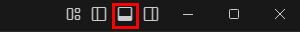

- **Paso 3.** Usa la terminal de **`Git Bash`**, da clic como lo muestra la imagen.

  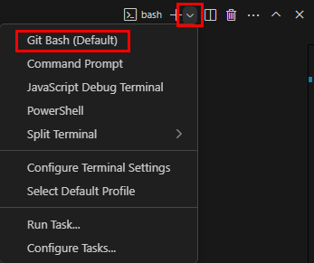

- **Paso 4.** Verifica que esten instalados los softwares necesarios, Docker y Docker Compose.

  ```bash
  docker --version
  ```

  ---

  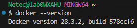

  ---

  ```bash
  docker compose version
  ```

  ---

  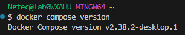

- **Paso 5.** Verifica Node.js y npm:

  ```bash
  node -v
  ```

  ---

  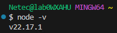

  ---

  ```bash
  npm -v
  ```

  ---

  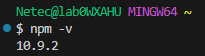

- **Paso 6.** Crea la estructura base del proyecto, en el **Escritorio** del equipo asignado:

  - Si es necesario escribe `ls` para ver los directorios creados como  lo muestra la imagen.

  ```bash
  cd Desktop/
  mkdir citas-app && cd citas-app
  mkdir ms-pacientes ms-medicos ms-citas frontend
  ```

  ---

  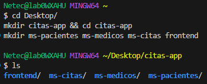

> **¡TAREA FINALIZADA!**

**Resultado esperado:** El usuario tiene acceso a la terminal y confirma que Docker, Compose y Node.js están instalados. La estructura del proyecto está creada.

---

### Tarea 2: Crear microservicio de pacientes

Construcción del microservicio con Node.js y Dockerfile.

#### Tarea 2.1

- **Paso 7.** En `ms-pacientes/`, crea el archivo `app.js`:

  ```bash
  cd ms-pacientes/
  touch app.js
  ls
  ```

  ---

  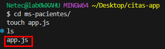

- **Paso 8.** Abre el archivo, copia y pega el siguiente codigo y guardalo.

  - Escribe en la terminal el siguiente comando para abrir el archivo: `code app.js`
  - Guarda el archivo.

  ```js
  const express = require('express');
  const cors = require('cors');
  const app = express();
  app.use(cors());
  app.use(express.json());

  let pacientes = [];

  app.get('/pacientes', (req, res) => res.json(pacientes));

  app.post('/pacientes', (req, res) => {
    const { nombre } = req.body;
    if (!nombre) return res.status(400).json({ error: 'Nombre requerido' });
    const paciente = { id: pacientes.length + 1, nombre };
    pacientes.push(paciente);
    res.status(201).json(paciente);
  });

  app.listen(3001, () => console.log('Pacientes API corriendo en puerto 3001'));
  ```

- **Paso 9.** Crea el archivo `package.json`, agrega el codigo de abajo:

  - Escribe `touch package.json` en la terminal.
  - Escribe `code package.json` 

  **NOTA:** Asgurate de estar dentro de la carpeta `ms-pacientes`.

  ```json
  {
    "name": "ms-pacientes",
    "version": "1.0.0",
    "main": "app.js",
    "dependencies": {
      "express": "^4.18.2",
      "cors": "^2.8.5"
    }
  }
  ```

- **Paso 10.** Crea el archivo `Dockerfile`, agrega el codigo de abajo:

  - Escribe `touch Dockerfile` en la terminal.
  - Escribe `code Dockerfile` 

  ```Dockerfile
  FROM node:18
  WORKDIR /app
  COPY package*.json ./
  RUN npm install
  COPY . .
  EXPOSE 3001
  CMD ["node", "app.js"]
  ```

> **¡TAREA FINALIZADA!**

**Resultado esperado:** El microservicio `ms-pacientes` está preparado con su código base y Dockerfile.

---

### Tarea 3: Crear los microservicios `ms-medicos` y `ms-citas` 

A partir de `ms-pacientes`, se crearán dos nuevos microservicios con código adaptado para manejar médicos y citas. Cada uno tendrá su propio puerto, rutas y archivo Dockerfile con el puerto correcto.

#### Tarea 3.1

- **Paso 11.** Copia el contenido base del microservicio `ms-pacientes`:

  **NOTA:** Asegurte de estar dentro de la carpeta **ms-pacientes**.

  ```bash
  cp -r ../ms-pacientes/* ../ms-medicos
  ls ../ms-medicos
  ```
  
  ---

  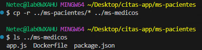

  ---

  ```bash
  cp -r ../ms-pacientes/* ../ms-citas/
  ```

  ---

  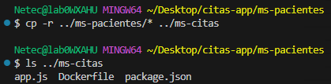

- **Paso 12.** En `ms-medicos/app.js`, reemplaza el contenido por:

  - Escribe `cd ../ms-medicos` para cambiar de directorio.
  - Escribe `code app.js` para editar el archivo
  - Borra el contenido y pega el de abajo

  ```js
  const express = require('express');
  const cors = require('cors');
  const app = express();
  app.use(cors());
  app.use(express.json());

  let medicos = [];

  app.get('/medicos', (req, res) => res.json(medicos));

  app.post('/medicos', (req, res) => {
    const { nombre } = req.body;
    if (!nombre) return res.status(400).json({ error: 'Nombre requerido' });
    const medico = { id: medicos.length + 1, nombre };
    medicos.push(medico);
    res.status(201).json(medico);
  });

  app.listen(3002, () => console.log('Medicos API corriendo en puerto 3002'));
  ```

- **Paso 13.** En `ms-medicos/Dockerfile`, cambia el puerto expuesto:

  - Escribe `code Dockerfile` para editar el archivo.
  - Agrega el siguiente codigoo solo modifica el puerto

  ```Dockerfile
  FROM node:18
  WORKDIR /app
  COPY package*.json ./
  RUN npm install
  COPY . .
  EXPOSE 3002
  CMD ["node", "app.js"]
  ```

- **Paso 14.** En `ms-citas/app.js`, reemplaza el contenido por:

  - Escribe `cd ../ms-citas` para cambiar de directorio.
  - Escribe `code app.js` para editar el archivo

  ```js
  const express = require('express');
  const cors = require('cors');
  const app = express();
  app.use(cors());
  app.use(express.json());

  let citas = [];

  app.get('/citas', (req, res) => res.json(citas));

  app.post('/citas', (req, res) => {
    const { paciente, medico, fecha } = req.body;
    if (!paciente || !medico || !fecha) {
      return res.status(400).json({ error: 'Paciente, medico y fecha son requeridos' });
    }
    const cita = {
      id: citas.length + 1,
      paciente,
      medico,
      fecha
    };
    citas.push(cita);
    res.status(201).json(cita);
  });

  app.listen(3003, () => console.log('Citas API corriendo en puerto 3003'));
  ```

- **Paso 15.** En `ms-citas/Dockerfile`, cambia el puerto expuesto:

  - Escribe `code Dockerfile` para editar el archivo.
  - Agrega el siguiente codigo o reemplaza el puerto.

  ```Dockerfile
  FROM node:18
  WORKDIR /app
  COPY package*.json ./
  RUN npm install
  COPY . .
  EXPOSE 3003
  CMD ["node", "app.js"]
  ```

> **¡TAREA FINALIZADA!**

**Resultado esperado:**  

Los tres microservicios (`pacientes`, `medicos`, `citas`) están separados, escuchan en puertos distintos y exponen rutas REST independientes (`/pacientes`, `/medicos`, `/citas`). Cada Dockerfile expone su puerto respectivo.

---

### Tarea 4: Crear la interfaz web del paciente  

Se desarrollará una interfaz sencilla para registrar pacientes.

#### Tarea 4.1

- **Paso 16.** Crea `frontend/index.html`:

  - Escribe `cd ../frontend` para cambiar de directorio.
  - Escribe `touch index.html` para crear el archivo.
  - Escribe `code index.html` para editar el archivo.

  ```html
  <!DOCTYPE html>
  <html lang="es">
  <head>
    <meta charset="UTF-8">
    <title>Agenda Médica</title>
    <style>
      body { font-family: sans-serif; padding: 30px; background: #f0f0f0; }
      h1 { color: #2c3e50; }
      form, .section { margin-bottom: 30px; background: #fff; padding: 20px; border-radius: 6px; }
      input { margin-bottom: 10px; padding: 8px; width: 250px; display: block; }
      button { padding: 8px 16px; background: #3498db; color: white; border: none; cursor: pointer; }
      button:hover { background: #2980b9; }
      #resultado { margin-top: 15px; font-weight: bold; }
      textarea { width: 100%; height: 100px; }
    </style>
  </head>
  <body>
    <h1>Agenda Médica</h1>

    <form id="formPaciente">
      <h3>Registrar Paciente</h3>
      <input type="text" id="nombrePaciente" placeholder="Nombre del paciente" required />
      <button type="submit">Registrar Paciente</button>
    </form>

    <form id="formMedico">
      <h3>Registrar Médico</h3>
      <input type="text" id="nombreMedico" placeholder="Nombre del médico" required />
      <button type="submit">Registrar Médico</button>
    </form>

    <form id="formCita">
      <h3>Registrar Cita</h3>
      <input type="text" id="nombreCitaPaciente" placeholder="Nombre del paciente" required />
      <input type="text" id="nombreCitaMedico" placeholder="Nombre del médico" required />
      <input type="date" id="fechaCita" required />
      <button type="submit">Registrar Cita</button>
    </form>

    <div class="section">
      <h3>Consultar Citas</h3>
      <button onclick="consultarCitas()">Ver Citas</button>
      <textarea id="listaCitas" readonly></textarea>
    </div>

    <div id="resultado"></div>

    <script>
      const resultado = document.getElementById('resultado');

      document.getElementById('formPaciente').onsubmit = async e => {
        e.preventDefault();
        const nombre = document.getElementById('nombrePaciente').value.trim();
        const res = await fetch('http://localhost:3001/pacientes', {
          method: 'POST',
          headers: { 'Content-Type': 'application/json' },
          body: JSON.stringify({ nombre })
        });
        const data = await res.json();
        resultado.innerText = `✅ Paciente registrado: ${data.nombre}`;
      };

      document.getElementById('formMedico').onsubmit = async e => {
        e.preventDefault();
        const nombre = document.getElementById('nombreMedico').value.trim();
        const res = await fetch('http://localhost:3002/medicos', {
          method: 'POST',
          headers: { 'Content-Type': 'application/json' },
          body: JSON.stringify({ nombre })
        });
        const data = await res.json();
        resultado.innerText = `✅ Médico registrado: ${data.nombre}`;
      };

      document.getElementById('formCita').onsubmit = async e => {
        e.preventDefault();
        const paciente = document.getElementById('nombreCitaPaciente').value.trim();
        const medico = document.getElementById('nombreCitaMedico').value.trim();
        const fecha = document.getElementById('fechaCita').value;
        const res = await fetch('http://localhost:3003/citas', {
          method: 'POST',
          headers: { 'Content-Type': 'application/json' },
          body: JSON.stringify({ paciente, medico, fecha })
        });
        const data = await res.json();
        resultado.innerText = `✅ Cita registrada para ${data.paciente} con ${data.medico} el ${data.fecha}`;
      };

      async function consultarCitas() {
        const res = await fetch('http://localhost:3003/citas');
        const data = await res.json();
        const textArea = document.getElementById('listaCitas');
        textArea.value = data.map(c => `🗓️ ${c.fecha} - ${c.paciente} con ${c.medico}`).join('\n');
      }
    </script>
  </body>
  </html>
  ```

> **¡TAREA FINALIZADA!**

**Resultado esperado:** El HTML permite enviar datos de paciente al microservicio correspondiente.

---

### Tarea 5: Configurar docker-compose.yml 

Se levantará el entorno completo con un solo comando.

#### Tarea 5.1

- **Paso 17.** Crear `docker-compose.yml` en raíz del proyecto y copia y pega el contenido:

  - Escribe `cd ..` para salir del directorio actual y entrar **en raíz de `citas-app`**.
  - Escribe `touch docker-compose.yml` para crear el archivo.
  - Escribe `code docker-compose.yml` para entrar al archivo.

  ```yaml
  version: '3.8'
  services:
    pacientes:
      build: ./ms-pacientes
      ports:
        - "3001:3001"

    medicos:
      build: ./ms-medicos
      ports:
        - "3002:3002"

    citas:
      build: ./ms-citas
      ports:
        - "3003:3003"

    frontend:
      image: nginx:alpine
      volumes:
        - ./frontend:/usr/share/nginx/html
      ports:
        - "8080:80"
  ```

> **¡TAREA FINALIZADA!**

**Resultado esperado:** El archivo de configuración orquesta los 4 servicios.

---

### Tarea 6: Construcción y validación 

Compilar las imágenes y validar el correcto funcionamiento.

#### Tarea 6.1

- **Paso 18.** Escribe el siguiente comando para construir las imágenes:

  **NOTA:** La compilación puede tardar unos segundos/minutos.
  - **RECUERDA** estar dentro del directorio **ms-citas**

  ```bash
  docker compose build
  ```

  ---

  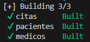  

- **Paso 19.** Escribe el siguiente comando para levantar los contenedores:

  ```bash
  docker compose up -d
  ```

  ---

  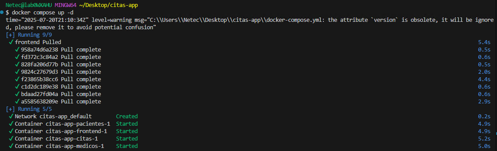  

- **Paso 20.** Escribe el siguiente comando para validar los contenedores:

  ```bash
  docker compose ps
  ```

  ---

  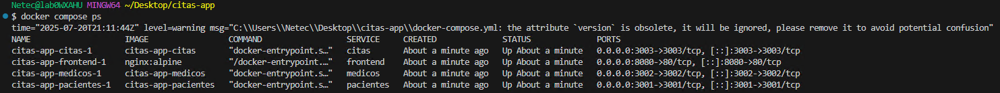

- **Paso 18.** Validar endpoints mediante CLI:

  **NOTA:** Este dara un resultado vacio ya que no hay pacientes.

  ```bash
  curl http://localhost:3001/pacientes
  ```

- **Paso 19.** Intenta registrar un paciente con el siguiente comando.

  ```bash
  curl -X POST http://localhost:3001/pacientes -H "Content-Type: application/json" -d '{"nombre":"Juan"}'
  ```

  ---

  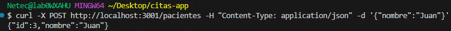

- **Paso 20.** Accede al navegador en `http://localhost:8080` y registra un paciente, doctor y crea una cita.

  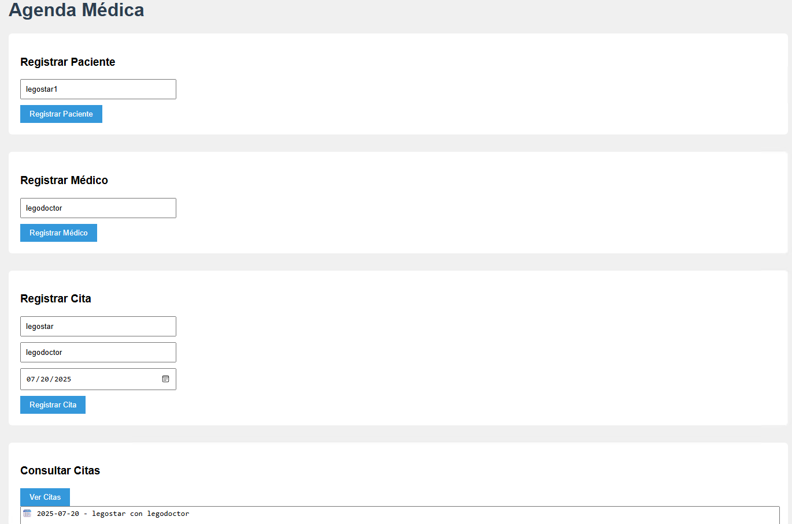

> **¡TAREA FINALIZADA!**

**Resultado esperado:** Todos los servicios están funcionando y se puede registrar un paciente desde el navegador.

---

> **¡FELICIDADES HAZ COMPLETADO EL LABORATORIO 1!**

---

## Resultado final  

El entorno base de microservicios está construido con imágenes Docker personalizadas, orquestado con Docker Compose y verificado con pruebas manuales y desde el navegador. Se tiene una base funcional para desplegar en Amazon EKS en la siguiente práctica.

## Notas y/o Consideraciones  

- Esta práctica no incluye persistencia en base de datos (MongoDB), se usaron estructuras en memoria para simplificar.  
- Asegúrate de que los puertos 3001–3003 y 8080 no estén ocupados en tu equipo.  
- Si usas WSL2 o Mac, verifica el acceso por `localhost` desde tu navegador.  

## URLS de referencia  

- [Docker Compose](https://docs.docker.com/compose/)  
- [Express JS](https://expressjs.com/)  
- [Node JS](https://nodejs.org/)  
- [HTML](https://developer.mozilla.org/es/docs/Web/HTML)

---

**[⬅️ Atrás](https://netec-mx.github.io/MICR_INT_Priv/Capítulo5/lab6.html)** | **[Lista General](https://netec-mx.github.io/MICR_INT_Priv/)** | **[Siguiente ➡️](https://netec-mx.github.io/MICR_INT_Priv/Capítulo2/lab2.html)**