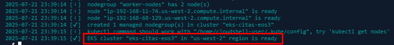
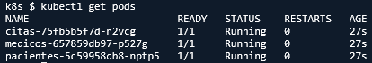

# Práctica 2: Despliegue de una aplicación contenerizada en Amazon EKS usando kubectl

## Objetivo  

Crear un clúster de Amazon EKS y desplegar en él la aplicación de citas médicas utilizando imágenes almacenadas en AWS ECR. Se utilizará `kubectl` para aplicar los manifiestos de Kubernetes que definen los microservicios `pacientes`, `medicos`, `citas` y el `frontend`.

## Requisitos
  
- Práctica 1 completada y funcional  
- AWS CLI, `kubectl` y `eksctl` instalados  
- Docker instalado y configurado  
- IAM con permisos para crear EKS, ECR, EC2 y Load Balancers  
- Acceso a una terminal Bash o PowerShell

## Duración aproximada

- 60 minutos

## Región de AWS

- us-west-2 (Oregón)

## Introducción  

En esta práctica se levantará una infraestructura EKS desde cero, se almacenarán las imágenes de los microservicios en ECR y se desplegarán los recursos de Kubernetes con `kubectl`. El objetivo es tener la aplicación 100% funcional sobre EKS con acceso externo al frontend.

---

**[⬅️ Atrás](https://netec-mx.github.io/MICR_INT_Priv/Capítulo1/lab1.html)** | **[Lista General](https://netec-mx.github.io/MICR_INT_Priv/)** | **[Siguiente ➡️](https://netec-mx.github.io/MICR_INT_Priv/Capítulo3/lab3.html)**

---

## Instrucciones

### Tarea 1: Iniciar sesión en la consola AWS

**Descripción:** Acceder como usuario IAM.

#### Tarea 1.1

- **Paso 1.** Ir a [AWS Console](https://aws.amazon.com/console)

- **Paso 2.** Clic en **Sign in**

- **Paso 3.** Iniciar sesión con:

  - Account ID or alias: `Cuenta asignada en el curso`
  - IAM username: `Asignado en el curso`
  - Password: `Asignada en el curso`

- **Paso 4.** Verificar que estás en la región `us-west-2`

    

> **TAREA FINALIZADA**

**Resultado esperado:** Acceso exitoso a la consola.

---

### Tarea 2: Instalar `eksctl` en AWS CloudShell

**Descripción:** AWS CloudShell no incluye `eksctl`, por lo tanto, se instalará y verificará su funcionamiento.

#### Tarea 2.1 – Instalación y verificación

- **Paso 5.** Abre **AWS CloudShell** dando clic en el icono te la terminal.

  

- **Paso 6.** Ejecuta los siguientes comandos para descargar e instalar `eksctl`:

  ```bash
  curl --silent --location "https://github.com/weaveworks/eksctl/releases/latest/download/eksctl_$(uname -s)_amd64.tar.gz" | tar xz -C /tmp
  ```

  ---

  ```bash
  sudo mv /tmp/eksctl /usr/local/bin
  ```

- **Paso 7.** Verifica la instalación:

  **NOTA:** La version puede variar.

  ```bash
  eksctl version
  ```

  ---

  

> **TAREA FINALIZADA**

**Resultado esperado:** La versión de `eksctl` aparece correctamente instalada.

---

### Tarea 3: Crear el clúster de Amazon EKS  

**Descripción:** Usaremos `eksctl` para crear un clúster EKS con 2 nodos administrados en `us-west-2`.

#### Tarea 3.1 – Crear y validar el clúster  

- **Paso 8.** Define las variables. Sustituye las letras `xxxx`por tus iniciales o letras y numeros aleatorios.

  ```bash
  CLUSTER_NAME=eks-citas-xxxx
  REGION=us-west-2
  ```

  ---

  

- **Paso 9.** Crea el clúster con nodos administrados, copia y pega el siguiente comando en la terminal AWS CloudShell:

  **IMPORTANTE:** La creación del cluster puede tardar 10 a 15 minutos.

  ```bash
  eksctl create cluster \
    --name $CLUSTER_NAME \
    --region $REGION \
    --nodegroup-name worker-nodes \
    --node-type t3.small \
    --nodes 2 \
    --managed
  ```

  ---

  

  **NOTA:** Avanza a la **Tarea 4** para subir las imagenes en lo que termina de crear el cluster.

- **Paso 10.** Ya creado el cluster escribe el siguiente comando para validar que todo este correctamente creado:

  ```bash
  kubectl get nodes
  ```

  ---

  

  **IMPORTANTE:** Una vez verificado el cluster avanza a la **Tarea 5**, siempre y cuando hayas terminado la **Tarea 4**.

> **TAREA FINALIZADA**

**Resultado esperado:** Deben aparecer dos nodos `Ready`.

---

### Tarea 4: Crear repositorios ECR y subir imágenes

**Descripción:** Se crearán repositorios para los servicios y se subirán las imágenes Docker a ECR.

#### Tarea 4.1 – Crear repositorios 

- **Paso 11.** En la terminal de AWS CloudShell abre otra pestaña y elije `us-west-2` donde crearas los repositorios en ECR.

  

- **Paso 12.** Ahora en la terminal de AWS CloudShell escribe los siguientes comandos:

  **NOTA:** Puedes copiar y pegar todos juntos o hacerlo uno por uno.

  ```bash
  aws ecr create-repository --repository-name ms-pacientes
  aws ecr create-repository --repository-name ms-medicos
  aws ecr create-repository --repository-name ms-citas
  aws ecr create-repository --repository-name ms-frontend
  ```

- **Paso 13.** Escribe el siguiente comando para verificar la creación de todos los repositorios.

  ```bash
  aws ecr describe-repositories --query "repositories[*].repositoryName" --output table
  ```

  ---

  

#### Tarea 4.2 – Login en ECR y definición de variables

- **Paso 14.** Ahora ve a tu `Visual Studio Code` y abre la terminal de `GitBash`.

- **Paso 15.** Dentro de la terminal define variables de entorno para la autenticación de ECR:

  **NOTA:** Puedes copiar todas juntas o 1 por 1.

  ```bash
  ACCOUNT_ID=$(aws sts get-caller-identity --query Account --output text)
  REGION=us-west-2
  ECR_URI=$ACCOUNT_ID.dkr.ecr.$REGION.amazonaws.com
  ```

- **Paso 16.** Escribe el siguiente comando para autenticarte a ECR:

  ```bash
  aws ecr get-login-password --region $REGION | docker login --username AWS --password-stdin $ECR_URI
  ```

  ---

  

#### Tarea 4.3 – Construcción, etiquetado y push de imágenes

- **Paso 17.** Ahora verifica que tengas las imagenes creadas del laboratorio 1, escribe el siguiente comando.

  ```bash
  docker images
  ```

  ---

  

- **Paso 18.** Si te hace falta alguna, puedes compilarla individualmente con los siguientes comandos.

  **IMPORTANTE:** Si tienes todas las imagenes avanza al siguiente paso.

  ```bash
  docker build -t ms-pacientes ./ms-pacientes
  ```
  
  ---

  ```bash
  docker build -t ms-medicos ./ms-medicos
  ```
  
  ---

  ```bash
  docker build -t ms-citas ./ms-citas
  ```

- **Paso 19.** Comienza a etiquetar y subir las imagenes.

  **NOTA:** Si es necesario ajusta los nombres de las imagenes.

  - **Pacientes**

  ```bash
  docker tag citas-app-pacientes $ECR_URI/ms-pacientes:ms-pacientes-v1
  docker push $ECR_URI/ms-pacientes:ms-pacientes-v1
  ```

  ---

  

- **Paso 20.** Comienza a etiquetar y subir las imagenes.

  **NOTA:** Si es necesario ajusta los nombres de las imagenes.

  - **Medicos**

  ```bash
  docker tag citas-app-medicos $ECR_URI/ms-medicos:ms-medicos-v1
  docker push $ECR_URI/ms-medicos:ms-medicos-v1
  ```

  ---

  

- **Paso 21.** Comienza a etiquetar y subir las imagenes.

  **NOTA:** Si es necesario ajusta los nombres de las imagenes.

  - **Citas**

  ```bash
  docker tag citas-app-citas $ECR_URI/ms-citas:ms-citas-v1
  docker push $ECR_URI/ms-citas:ms-citas-v1
  ```

  ---

  

- **Paso 22.** Ahora verifica con cada uno de los siguientes comandos que las imagenes se hayan subido correctamente.

  - **Pacientes**

  ```bash
  aws ecr list-images --repository-name ms-pacientes --output table
  ```

  ---

  

  ---

    - **Medicos**

  ```bash
  aws ecr list-images --repository-name ms-medicos --output table
  ```

  ---

  

  ---

    - **Citas**

  ```bash
  aws ecr list-images --repository-name ms-citas --output table
  ```

  ---

  

- **Paso 23.** Ahora regresa a la **Tarea 3.1** para verificar que el cluster se haya creado correctamente.

> **TAREA FINALIZADA**

**Resultado esperado:** Los 3 repositorios deben estar creados y con las imagenes correctamente cargadas.

---

### Tarea 5: Crear manifiestos Kubernetes  

**Descripción:** Se definirán los recursos de Kubernetes (`Deployment`, `Service`) para cada microservicio.

#### Tarea 5.1 – Crear manifiestos en directorio `k8s/`

- **Paso 24.** Ahora regresa a la terminal **AWS CloudShell** en la `Consola de AWS`

- **Paso 25.** Crea la carpeta y navega al interior:

  ```bash
  mkdir k8s && cd k8s
  ```

  ---

  

- **Paso 26.** Crea los archivos siguientes (reemplaza `<ECR_URI>`):

  - Escribe el siguiente comando: `echo $ECR_URI` sino te da resultado vuelve a la **Tarea 4.2**
  - Crea el archivo llamado: `touch pacientes-deployment.yaml`
  - Edita el archivo con nano u otro editor: `nano pacientes-deployment.yaml`
  - Pega el contenido yaml.
  - Edita la URI del respositorio
  - Para salir del editor ejecuta `CTRL + O` Enter y `CTRL + X`

  ```yaml
  apiVersion: apps/v1
  kind: Deployment
  metadata:
    name: pacientes
  spec:
    replicas: 1
    selector:
      matchLabels:
        app: pacientes
    template:
      metadata:
        labels:
          app: pacientes
      spec:
        containers:
        - name: pacientes
          image: <ECR_URI>/ms-pacientes:ms-pacientes-v1
          ports:
          - containerPort: 3001
  ---
  apiVersion: v1
  kind: Service
  metadata:
    name: pacientes
  spec:
    selector:
      app: pacientes
    ports:
      - port: 80
        targetPort: 3001
    type: LoadBalancer
  ```

- **Paso 27.** Crea los archivos siguientes (reemplaza `<ECR_URI>`):

  - Escribe el siguiente comando: `echo $ECR_URI` sino te da resultado vuelve a la **Tarea 4.2**
  - Crea el archivo llamado: `touch medicos-deployment.yaml`
  - Edita el archivo con nano u otro editor: `nano medicos-deployment.yaml`
  - Pega el contenido yaml.
  - Edita la URI del respositorio
  - Para salir del editor ejecuta `CTRL + O` Enter y `CTRL + X`

  ```yaml
  apiVersion: apps/v1
  kind: Deployment
  metadata:
    name: medicos
  spec:
    replicas: 1
    selector:
      matchLabels:
        app: medicos
    template:
      metadata:
        labels:
          app: medicos
      spec:
        containers:
        - name: medicos
          image: <ECR_URI>/ms-medicos:ms-medicos-v1
          ports:
          - containerPort: 3002
  ---
  apiVersion: v1
  kind: Service
  metadata:
    name: medicos
  spec:
    selector:
      app: medicos
    ports:
      - port: 80
        targetPort: 3002
    type: LoadBalancer
  ```

- **Paso 28.** Crea los archivos siguientes (reemplaza `<ECR_URI>`):

  - Escribe el siguiente comando: `echo $ECR_URI` sino te da resultado vuelve a la **Tarea 4.2**
  - Crea el archivo llamado: `touch citas-deployment.yaml`
  - Edita el archivo con nano u otro editor: `nano citas-deployment.yaml`
  - Pega el contenido yaml.
  - Edita la URI del respositorio
  - Para salir del editor ejecuta `CTRL + O` Enter y `CTRL + X`

  ```yaml
  apiVersion: apps/v1
  kind: Deployment
  metadata:
    name: citas
  spec:
    replicas: 1
    selector:
      matchLabels:
        app: citas
    template:
      metadata:
        labels:
          app: citas
      spec:
        containers:
        - name: citas
          image: <ECR_URI>/ms-citas:ms-citas-v1
          ports:
          - containerPort: 3003
  ---
  apiVersion: v1
  kind: Service
  metadata:
    name: citas
  spec:
    selector:
      app: citas
    ports:
      - port: 80
        targetPort: 3003
    type: LoadBalancer
  ```

> **¡TAREA FINALIZADA!**

**Resultado esperado:** Manifiestos creados correctamente.

---

### Tarea 6: Desplegar en EKS y validar servicios

**Descripción:** Aplicar los manifiestos y verificar que los pods y servicios estén activos.

#### Tarea 6.1 – Aplicar manifiestos

- **Paso 29.** Desde el directorio `k8s/`:

  ```bash
  kubectl apply -f .
  ```

  ---

  

#### Tarea 6.2 – Validar pods y servicios 

- **Paso 30.** Verifica los pods:

  ```bash
  kubectl get pods
  ```

  ---

  

- **Paso 31.** Verifica servicios:

  ```bash
  kubectl get svc
  ```

  ---

  

- **Paso 32.** Ahora copia el valor de la propiedad **`EXTERNLA-IP`** de cada microservicio, citas, medicos y pacientes. Guardalo en un block de notas temporalmente.

> **TAREA FINALIZADA**

**Resultado esperado:** Los servicios `pacientes, medicos y citas` deben tener una IP/DNS externa.

---

### Tarea 7: Ajustar y desplegar el Frontend

**Descripción:** Se ajustaran los archivos necesarios para el frontend del microservicio y se crearan los archivos de Kubernetes

#### Tarea 7.1 – Ajustar microservicio

- **Paso 33.** Ahora ve a tu `Visual Studio Code` y abre la terminal de `GitBash`.

- **Paso 34.** Abre el archivo `index.html`. Escribe el siguiente comando en la terminal.

  **NOTA:** Si es necesario ajusta las rutas del directorio.

  ```bash
  code frontend/index.html
  ```

- **Paso 35.** Ahora elimina el contenido existente del index y sustituyelo por el siguiente codigo.

  ```html
  <!DOCTYPE html>
  <html lang="es">

  <head>
    <meta charset="UTF-8">
    <title>Agenda Médica</title>
    <style>
      body {
        font-family: sans-serif;
        padding: 30px;
        background: #f0f0f0;
      }

      h1 {
        color: #2c3e50;
      }

      form,
      .section {
        margin-bottom: 30px;
        background: #fff;
        padding: 20px;
        border-radius: 6px;
      }

      input {
        margin-bottom: 10px;
        padding: 8px;
        width: 250px;
        display: block;
      }

      button {
        padding: 8px 16px;
        background: #3498db;
        color: white;
        border: none;
        cursor: pointer;
      }

      button:hover {
        background: #2980b9;
      }

      #resultado {
        margin-top: 15px;
        font-weight: bold;
      }

      textarea {
        width: 100%;
        height: 100px;
      }
    </style>
  </head>

  <body>
    <h1>Agenda Médica</h1>

    <form id="formPaciente">
      <h3>Registrar Paciente</h3>
      <input type="text" id="nombrePaciente" placeholder="Nombre del paciente" required />
      <button type="submit">Registrar Paciente</button>
    </form>

    <form id="formMedico">
      <h3>Registrar Médico</h3>
      <input type="text" id="nombreMedico" placeholder="Nombre del médico" required />
      <button type="submit">Registrar Médico</button>
    </form>

    <form id="formCita">
      <h3>Registrar Cita</h3>
      <input type="text" id="nombreCitaPaciente" placeholder="Nombre del paciente" required />
      <input type="text" id="nombreCitaMedico" placeholder="Nombre del médico" required />
      <input type="date" id="fechaCita" required />
      <button type="submit">Registrar Cita</button>
    </form>

    <div class="section">
      <h3>Consultar Citas</h3>
      <button onclick="consultarCitas()">Ver Citas</button>
      <textarea id="listaCitas" readonly></textarea>
    </div>

    <div id="resultado"></div>

    <script>
      const resultado = document.getElementById('resultado');

      const PACIENTES_API = 'http://URL_PACIENTES/pacientes';
      const MEDICOS_API = 'http://URL_MEDICOS/medicos';
      const CITAS_API = 'http://URL_CITAS/citas';

      document.getElementById('formPaciente').onsubmit = async e => {
        e.preventDefault();
        const nombre = document.getElementById('nombrePaciente').value.trim();
        const res = await fetch(PACIENTES_API, {
          method: 'POST',
          headers: { 'Content-Type': 'application/json' },
          body: JSON.stringify({ nombre })
        });
        const data = await res.json();
        resultado.innerText = `✅ Paciente registrado: ${data.nombre}`;
      };

      document.getElementById('formMedico').onsubmit = async e => {
        e.preventDefault();
        const nombre = document.getElementById('nombreMedico').value.trim();
        const res = await fetch(MEDICOS_API, {
          method: 'POST',
          headers: { 'Content-Type': 'application/json' },
          body: JSON.stringify({ nombre })
        });
        const data = await res.json();
        resultado.innerText = `✅ Médico registrado: ${data.nombre}`;
      };

      document.getElementById('formCita').onsubmit = async e => {
        e.preventDefault();
        const paciente = document.getElementById('nombreCitaPaciente').value.trim();
        const medico = document.getElementById('nombreCitaMedico').value.trim();
        const fecha = document.getElementById('fechaCita').value;
        const res = await fetch(CITAS_API, {
          method: 'POST',
          headers: { 'Content-Type': 'application/json' },
          body: JSON.stringify({ paciente, medico, fecha })
        });
        const data = await res.json();
        resultado.innerText = `✅ Cita registrada para ${data.paciente} con ${data.medico} el ${data.fecha}`;
      };

      async function consultarCitas() {
        const res = await fetch(CITAS_API);
        const data = await res.json();
        const textArea = document.getElementById('listaCitas');
        textArea.value = data.map(c => `🗓️ ${c.fecha} - ${c.paciente} con ${c.medico}`).join('\n');
      }
    </script>

  </body>

  </html>
  ```

- **Paso 36.** Ahora identifica la siguientes variables, `const PACIENTES_API, MEDICOS_API, CITAS_API` pueden estar en las lineas 91 a 93.

- **Paso 37.** Agrega las URLs de cada microservicio que copiaste en la tarea anterior. La siguiente imagen muestar un ejemplo de como debe quedar pero con tus URLs.

  **NOTA:** La imagen es demostrativa, no debe quedar identica ni debes copiar los datos de la imagen.

  

- **Paso 38.** Ahora ajustaremos el FrontEnd para que trabaje con Amazon EKS, ejecuta lo siguiente.

  - Escribe el siguiente comando: `touch frontend/Dockerfile`
  - Abre el archivo con: `code frontend/Dockerfile`
  - Agrega el codigo siguiente:

  ```bash
  FROM nginx:alpine
  COPY ./index.html /usr/share/nginx/html/index.html
  ```

- **Paso 39.** Compila la imagen con el siguiente comando.

  **NOTA:** Ajusta la ruta si es necesario

  ```bash
  docker build -t citas-app-frontend:latest ./frontend
  ```

- **Paso 40.** Ahora etiqueta y sube a imagen al repositorio previamente creado.

  ```bash
  docker tag citas-app-frontend $ECR_URI/ms-frontend:ms-frontend-v1
  docker push $ECR_URI/ms-frontend:ms-frontend-v1
  ```

  ---

   

#### Tarea 7.2 – Aplicar manifiestos

- **Paso 41.** Ahora regresa a la terminal **AWS CloudShell** en la `Consola de AWS`

- **Paso 42.** Crea los archivos siguientes (reemplaza `<ECR_URI>`):

  - Escribe el siguiente comando: `echo $ECR_URI` sino te da resultado vuelve a la **Tarea 4.2**
  - Crea el archivo llamado: `touch frontend-deployment.yaml`
  - Edita el archivo con nano u otro editor: `nano frontend-deployment.yaml`
  - Pega el contenido yaml.
  - Edita la URI del respositorio
  - Para salir del editor ejecuta `CTRL + O` Enter y `CTRL + X`

  ```yaml
  apiVersion: apps/v1
  kind: Deployment
  metadata:
    name: frontend
  spec:
    replicas: 1
    selector:
      matchLabels:
        app: frontend
    template:
      metadata:
        labels:
          app: frontend
      spec:
        containers:
        - name: frontend
          image: <ECR_URI>/ms-frontend:ms-frontend-v1
          ports:
          - containerPort: 80
  ---
  apiVersion: v1
  kind: Service
  metadata:
    name: frontend
  spec:
    selector:
      app: frontend
    ports:
      - port: 80
        targetPort: 80
    type: LoadBalancer
  ```

- **Paso 43.** Desde el directorio `k8s/` aplica la configuracion del frontend:

  ```bash
  kubectl apply -f frontend-deployment.yaml
  ```

  ---

  

#### Tarea 7.3 – Obtener IP/DNS pública

- **Paso 44.** Verifica IP del frontend:
  
  ```bash
  kubectl get svc frontend
  ```

  ---

  

> **TAREA FINALIZADA**

**Resultado esperado:** FrontEnd ajustado y configurado correctamente para la implementación con Amazon EKS

---

### Tarea 8: Validar la aplicación desde el navegador

**Descripción:** Se validará el flujo completo desde el frontend desplegado.

#### Tarea 8.1 – Abrir IP/DNS pública y probar  

- **Paso 45.** Abre:

  ```
  http://<EXTERNAL-IP>
  ```

  ---

  

- **Paso 35.** Valida los flujos:

  - Crear paciente
  - Crear médico
  - Crear cita
  - Ver citas

  ---

  

> **¡TAREA FINALIZADA!**

**Resultado esperado:** La aplicación funciona correctamente desde EKS.

---

> **¡FELICIDADES HAZ COMPLETADO EL LABORATORIO 2!**

---

## Resultado final

La aplicación de citas médicas está desplegada en Amazon EKS con imágenes desde ECR, manifiestos definidos, servicios activos y frontend accesible vía LoadBalancer.

## Notas y/o Consideraciones

- Puedes eliminar el clúster al terminar:

  ```bash
  eksctl delete cluster --name eks-citas-xxx --region us-west-2
  ```
- Los manifiestos se pueden mejorar con namespaces, HPA y ConfigMaps 

## URLS de referencia

- https://docs.aws.amazon.com/cloudshell/  
- https://eksctl.io/   
- https://kubernetes.io/docs/concepts/


---

**[⬅️ Atrás](https://netec-mx.github.io/MICR_INT_Priv/Capítulo1/lab1.html)** | **[Lista General](https://netec-mx.github.io/MICR_INT_Priv/)** | **[Siguiente ➡️](https://netec-mx.github.io/MICR_INT_Priv/Capítulo3/lab3.html)**