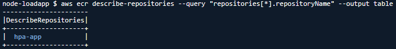

# Práctica 3: Escalado automático de Pods con HPA (Horizontal Pod Autoscaler)

## Objetivo  

Aplicar un `HorizontalPodAutoscaler` sobre una aplicación de un solo microservicio con interfaz gráfica, para permitir su escalado automático en función del uso de CPU, y validar su funcionamiento generando carga desde dentro del clúster EKS.

## Requisitos  

- Clúster EKS activo  
- `kubectl` funcionando y configurado  
- Permisos para usar métricas (`metrics-server`)    
- AWS CloudShell

## Duración aproximada

- 60 minutos

## Región de AWS

- us-west-2 (Oregón)

## Introducción

Kubernetes permite escalar dinámicamente los pods mediante el Horizontal Pod Autoscaler (HPA), el cual monitorea métricas como el uso de CPU o memoria. Esta práctica usa una nueva aplicación sencilla que genera carga, para demostrar el uso real del HPA.

---

**[⬅️ Atrás](https://netec-mx.github.io/MICR_INT_Priv/Capítulo2/lab2.html)** | **[Lista General](https://netec-mx.github.io/MICR_INT_Priv/)** | **[Siguiente ➡️](https://netec-mx.github.io/MICR_INT_Priv/Capítulo4/lab4.html)**

---

## Instrucciones

### Tarea 1: Iniciar sesión en la consola AWS

**Descripción:** Acceder como usuario IAM.

#### Tarea 1.1

- **Paso 1.** Ir a [AWS Console](https://aws.amazon.com/console)

- **Paso 2.** Clic en **Sign in**

- **Paso 3.** Iniciar sesión con:

  - Account ID or alias: `Cuenta asignada en el curso`
  - IAM username: `Asignado en el curso`
  - Password: `Asignada en el curso`

- **Paso 4.** Verificar que estás en la región `us-west-2`

    

> **TAREA FINALIZADA**

**Resultado esperado:** Acceso exitoso a la consola

---

### Tarea 2: Crear el clúster de Amazon EKS

**Descripción:** Usaremos `eksctl` para crear un clúster EKS con 2 nodos administrados en `us-west-2`.

#### Tarea 2.1 – Instalación y configuración

- **Paso 5.** Abre **AWS CloudShell** dando clic en el icono te la terminal.

  

- **Paso 6.** Ejecuta los siguientes comandos para descargar e instalar `eksctl`:

  ```bash
  curl --silent --location "https://github.com/weaveworks/eksctl/releases/latest/download/eksctl_$(uname -s)_amd64.tar.gz" | tar xz -C /tmp
  ```

  ---

  ```bash
  sudo mv /tmp/eksctl /usr/local/bin
  ```

- **Paso 7.** Define las variables. Sustituye las letras `xxxx`por tus iniciales o letras y numeros aleatorios.

  ```bash
  CLUSTER_NAME=eks-citas-xxxx
  REGION=us-west-2
  ```

  ---

  

- **Paso 8.** Crea el clúster con nodos administrados, copia y pega el siguiente comando en la terminal AWS CloudShell:

  **IMPORTANTE:** La creación del cluster puede tardar 10 a 15 minutos.

  ```bash
  eksctl create cluster \
    --name $CLUSTER_NAME \
    --region $REGION \
    --nodegroup-name worker-nodes \
    --node-type t3.small \
    --nodes 2 \
    --managed
  ```

  ---

  

  **NOTA:** Recuerda que el cluster puede tardar de **10 a 15 minutos**

> **TAREA FINALIZADA**

**Resultado esperado:** Cluster creado y configurado correctamente.

---

### Tarea 3: Crear e implementar la nueva aplicación web

**Descripción:** Usaremos una aplicación web Node.js que simula consumo de CPU. Tiene un solo microservicio y una interfaz gráfica para activar carga.

#### Tarea 3.1 – Crear estructura de aplicación personalizada

- **Paso 9.** Crea una carpeta para la aplicación:

  ```bash
  mkdir node-loadapp
  cd node-loadapp
  ```

- **Paso 10.** Inicializa un proyecto Node.js.

  ```bash
  npm init -y
  ```

- **Paso 11.** Instala Express.

  ```bash
  npm install express
  ```

#### Tarea 3.2 – Crear Dockerfile personalizado

- **Paso 12.** Crea un `Dockerfile` con Node.js:

  ```bash
  nano Dockerfile
  ```

- **Paso 13.** Agrega el siguiente contenido al Dockerfile.

  ```dockerfile
  FROM node:18

  WORKDIR /app

  COPY . .

  RUN npm install express

  EXPOSE 3000

  CMD ["node", "-e", "require('express')().get('/', (req, res) => { \
    let now = Date.now(); while(Date.now() - now < 200); \
    res.send('<h1>Hola! App web sencilla generando carga.</h1>'); \
  }).listen(3000)"]
  ```

- **Paso 13.** Ejecuta la combinación de teclas siguientes.

  - `CTRL + O` para guardar.
  - `CTRL + X`para salir del editor.

#### Tarea 3.3 – Construir y subir imagen a ECR

- **Paso 14.** Crear repositorio en ECR:

  ```bash
  aws ecr create-repository --repository-name hpa-app
  ```

- **Paso 15.** Valida la creación ejecutando el siguiente comando.

    ```bash
  aws ecr describe-repositories --query "repositories[*].repositoryName" --output table
  ```

  ---

  

- **Paso 16.** Define y exporta variables:

  ```bash
  ACCOUNT_ID=$(aws sts get-caller-identity --query Account --output text)
  REGION=us-west-2
  ECR_URI=$ACCOUNT_ID.dkr.ecr.$REGION.amazonaws.com
  ```

- **Paso 17.** Autenticate a Amazon ECR con el siguiente comando:

  ```bash
  aws ecr get-login-password --region $REGION | docker login --username AWS --password-stdin $ECR_URI
  ```

  ---

  

- **Paso 18.** Construye y sube imagen:

  **NOTA:** La aplicación puede tardar de 3 a 5 minutos en compilar.

  ```bash
  docker build -t hpa-app .
  ```

  ---

  ```bash
  docker tag hpa-app:latest $ECR_URI/hpa-app:v1
  docker push $ECR_URI/hpa-app:v1
  ```

- **Paso 19.** Verifica que la imagen este creada correctamente:

  ```bash
  aws ecr list-images --repository-name hpa-app --output table
  ```

  ---

  

> **TAREA FINALIZADA**

**Resultado esperado:** Tienes un contenedor expuesto al puerdo 3000 con una aplicación en node.js listo para probar el auto escalado.

---

### Tarea 4: Desplegar la app y configurar el servicio

**Descripción:** En esta tarea crearas los archivos para para realizar el despliegue de los archivos en EKS.

#### Tarea 4.1 – Crear manifiesto `deployment.yaml`

- **Paso 20.** Crea el siguiente archivo (reemplaza `<ECR_URI>`):

  - Escribe el siguiente comando: `echo $ECR_URI` sino te da resultado vuelve a la **Tarea 3.3**
  - Crea el archivo llamado: `touch deployment.yaml`
  - Edita el archivo con nano u otro editor: `nano deployment.yaml`
  - Pega el contenido yaml.
  - Edita la URI del respositorio
  - Para salir del editor ejecuta `CTRL + O` Enter y `CTRL + X`

  ```yaml
  apiVersion: apps/v1
  kind: Deployment
  metadata:
    name: hpa-app
  spec:
    replicas: 1
    selector:
      matchLabels:
        app: hpa-app
    template:
      metadata:
        labels:
          app: hpa-app
      spec:
        containers:
        - name: hpa-app
          image: <ECR_URI>/hpa-app:v1
          ports:
          - containerPort: 3000
          resources:
            requests:
              cpu: "100m"
            limits:
              cpu: "300m"
  ---
  apiVersion: v1
  kind: Service
  metadata:
    name: hpa-app
  spec:
    type: LoadBalancer
    selector:
      app: hpa-app
    ports:
      - port: 80
        targetPort: 3000
  ```

- **Paso 21.** Aplica el manifiesto:

  ```bash
  kubectl apply -f deployment.yaml
  ```

- **Paso 22.** Verifica IP externa del servicio:

  ```bash
  kubectl get svc hpa-app
  ```

> **TAREA FINALIZADA**

**Resultado esperado:** Deployment y servicio correctamente desplegado.

---

### Tarea 5: Instalar/Verificar metrics-server y configurar HPA

**Descripción:** Verificaras o en su defecto instalaras metrics server en el cluster de Amazon EKS

#### Tarea 5.1 – Instalar metrics-server

- **Paso 23.** Dependiendo del tipo de creación del cluster es como las APIs pueden venir instaladas o no, verifica que este instalado `Metrics Server`

  ```bash
  kubectl get pods -n kube-system | grep metrics-server
  ```
  
  ---

  

- **Paso 24.** Si en el paso anterior mostro los pods de metrics server en el estado **Running**, avanza al siguiente paso. De otra manera instala metrics server.

  **IMPORTANTE:** Si Metrics Server esta instalado, el siguiente comando no es necesario.

  ```bash
  kubectl apply -f https://github.com/kubernetes-sigs/metrics-server/releases/latest/download/components.yaml
  ```

#### Tarea 5.2 – Crear `hpa.yaml`

- **Paso 25.**  Crea el siguiente archivo.

  - Crea el archivo llamado: `touch hpa.yaml`
  - Edita el archivo con nano u otro editor: `nano hpa.yaml`
  - Pega el contenido yaml.
  - Para salir del editor ejecuta `CTRL + O` Enter y `CTRL + X`

  ```yaml
  apiVersion: autoscaling/v2
  kind: HorizontalPodAutoscaler
  metadata:
    name: hpa-app
  spec:
    scaleTargetRef:
      apiVersion: apps/v1
      kind: Deployment
      name: hpa-app
    minReplicas: 1
    maxReplicas: 5
    metrics:
    - type: Resource
      resource:
        name: cpu
        target:
          type: Utilization
          averageUtilization: 30
  ```

- **Paso 25.** Aplica el manifiesto.

  ```bash
  kubectl apply -f hpa.yaml
  ```

- **Paso 26.** Verifica que correctamente haya aplicado las reglas para el auto escalado HPA.

  ```bash
  kubectl get hpa
  ```

  ---

  

> **TAREA FINALIZADA**

**Resultado esperado:** Haz instalado y verificado correctamente Metrics Server junto con la creación del manifiesto HPA.

---

### Tarea 6: Generar carga y validar escalado

**Descripción:** En esta tarea validaras el funcionamiento correcto de la escalabilidad en Amazon EKS

#### Tarea 6.1 – Ejecutar carga desde un pod

- **Paso 27.** Crea y conectate a un pod temporal para hacer las pruebas.

  ```bash
  kubectl run -i --tty load-generator --image=busybox --restart=Never -- /bin/sh
  ```

- **Paso 28.** Ahora dentro del pod ejecuta el comando que simulara la carga.

  ```sh
  while true; do wget -q -O- http://hpa-app; done
  ```

- **Paso 29.** Observaras como empieza a crear la saturación simulada.

  **NOTA:** Espera 1-2 minutos

  

#### Tarea 6.2 – Ver el estado del HPA

- **Paso 30.** Ahora verifica la saturación de los pods y detectaras como trabaja el HPA.

- **Paso 31.** No rompas el proceso de saturación, abre otra terminal.

  

- **Paso 32.** Ahora ejecuta los siguientes comandos.

  ```bash
  kubectl get pods
  ```

  ---

  ```bash
  kubectl get hpa hpa-app -w
  ```

  ---

  

> **TAREA FINALIZADA**

**Resultado esperado:** El número de réplicas aumenta dinámicamente cuando el uso de CPU se incrementa

---

> **¡FELICIDADES HAZ COMPLETADO EL LABORATORIO 3!**

---

## Resultado final

Una aplicación sencilla con interfaz gráfica fue desplegada en Amazon EKS, y se configuró un HPA para escalar automáticamente los pods cuando se detecta un incremento en el uso de CPU.

## Notas y/o Consideraciones

- Puedes borrar los recursos con:

  ```bash
  kubectl delete hpa hpa-app
  kubectl delete deployment hpa-app
  kubectl delete svc hpa-app
  kubectl delete pod load-generator
  ```

## URLS de referencia

- https://docs.aws.amazon.com/eks/latest/userguide/
- https://kubernetes.io/docs/tasks/run-application/horizontal-pod-autoscale/

---

**[⬅️ Atrás](https://netec-mx.github.io/MICR_INT_Priv/Capítulo2/lab2.html)** | **[Lista General](https://netec-mx.github.io/MICR_INT_Priv/)** | **[Siguiente ➡️](https://netec-mx.github.io/MICR_INT_Priv/Capítulo4/lab4.html)**