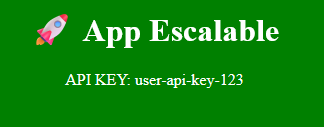

# Práctica 4: Inyección de configuración con ConfigMap y Secrets

## Objetivo 

Inyectar configuración externa en una aplicación desplegada en EKS mediante `ConfigMap` y `Secret`, demostrando cómo separar la lógica de negocio de la configuración en tiempo de ejecución.

## Requisitos  

- Clúster EKS activo    
- `kubectl` funcionando correctamente  
- AWS CloudShell

## Duración aproximada

- 60 minutos

## Región de AWS  

- us-west-2 (Oregón)

## Introducción  

En Kubernetes, `ConfigMap` y `Secret` permiten administrar parámetros de configuración externos a la imagen del contenedor. Esta práctica modifica el comportamiento visual y funcional de la aplicación usando ambas entidades, sin necesidad de reconstruir el contenedor cada vez que cambie un valor.

---

**[⬅️ Atrás](https://netec-mx.github.io/MICR_INT_Priv/Capítulo3/lab3.html)** | **[Lista General](https://netec-mx.github.io/MICR_INT_Priv/)** | **[Siguiente ➡️](https://netec-mx.github.io/MICR_INT_Priv/Capítulo4/lab5.html)**

---

## Instrucciones

### Tarea 1: Iniciar sesión en la consola AWS

**Descripción:** Acceder como usuario IAM.

#### Tarea 1.1

- **Paso 1.** Ir a [AWS Console](https://aws.amazon.com/console)

- **Paso 2.** Clic en **Sign in**

- **Paso 3.** Iniciar sesión con:

  - Account ID or alias: `Cuenta asignada en el curso`
  - IAM username: `Asignado en el curso`
  - Password: `Asignada en el curso`

- **Paso 4.** Verificar que estás en la región `us-west-2`

    

> **TAREA FINALIZADA**

**Resultado esperado:** Acceso exitoso a la consola

---

### Tarea 2: Crear el clúster de Amazon EKS

**Descripción:** Usaremos `eksctl` para crear un clúster EKS con 2 nodos administrados en `us-west-2`.

#### Tarea 2.1 – Instalación y configuración

- **Paso 5.** Abre **AWS CloudShell** dando clic en el icono te la terminal.

  

- **Paso 6.** Ejecuta los siguientes comandos para descargar e instalar `eksctl`:

  ```bash
  curl --silent --location "https://github.com/weaveworks/eksctl/releases/latest/download/eksctl_$(uname -s)_amd64.tar.gz" | tar xz -C /tmp
  ```

  ---

  ```bash
  sudo mv /tmp/eksctl /usr/local/bin
  ```

- **Paso 7.** Define las variables. Sustituye las letras `xxxx`por tus iniciales o letras y numeros aleatorios.

  ```bash
  CLUSTER_NAME=eks-citas-xxxx
  REGION=us-west-2
  ```

  ---

  

- **Paso 8.** Crea el clúster con nodos administrados, copia y pega el siguiente comando en la terminal AWS CloudShell:

  **IMPORTANTE:** La creación del cluster puede tardar 10 a 15 minutos.

  ```bash
  eksctl create cluster \
    --name $CLUSTER_NAME \
    --region $REGION \
    --nodegroup-name worker-nodes \
    --node-type t3.small \
    --nodes 2 \
    --managed
  ```

  ---

  

  **NOTA:** Recuerda que el cluster puede tardar de **10 a 15 minutos**

> **TAREA FINALIZADA**

**Resultado esperado:** Cluster creado y configurado correctamente.

---

### Tarea 3: Crear los recursos de configuración

**Descripción:** Crear un `ConfigMap` para los valores visuales y un `Secret` para valores sensibles.

#### Tarea 3.1 – Crear `configmap.yaml` dentro de `node-loadapp/`

- **Paso 9.** Dentro del directorio `node-loadapp/`.

  - Crea el archivo llamado: `touch configmap.yaml`
  - Edita el archivo con nano u otro editor: `nano configmap.yaml`
  - Copia y pega el contenido de abajo yaml.
  - Para salir del editor ejecuta `CTRL + O` Enter y `CTRL + X`

  ```yaml
  apiVersion: v1
  kind: ConfigMap
  metadata:
    name: app-config
  data:
    TITLE: "Bienvenido a la App HPA"
    COLOR: "#007acc"
  ```

- **Paso 10.** Aplica el archivo:

  **NOTA:** Ajusta la ruta del directorio si es necesario.

  ```bash
  kubectl apply -f configmap.yaml
  ```

#### Tarea 3.2 – Crear `secret.yaml` dentro de `node-loadapp/`

- **Paso 11.** Dentro del mismo directorio.

  - Crea el archivo llamado: `touch secret.yaml`
  - Edita el archivo con nano u otro editor: `nano secret.yaml`
  - Copia y pega el contenido de abajo yaml.
  - Para salir del editor ejecuta `CTRL + O` Enter y `CTRL + X`

  ```yaml
  apiVersion: v1
  kind: Secret
  metadata:
    name: app-secret
  type: Opaque
  data:
    API_KEY: dXNlci1hcGkta2V5LTEyMw==  # base64 de user-api-key-123
  ```

- **Paso 12.** Aplica el `Secret`:

  ```bash
  kubectl apply -f secret.yaml
  ```

- **Paso 13.** Verifica la creación de los 2 componentes.

  ```bash
  kubectl get configmap
  kubectl get secret
  ```

  ---

  

> **TAREA FINALIZADA**

**Resultado esperado:** Ambos recursos `configmaps`y `secret` creados correctamente.

---

### Tarea 4: Actualizar el código fuente de la app

**Descripción:** Modificar la app Node.js para leer `TITLE`, `COLOR` y `API_KEY` desde variables de entorno.

#### Tarea 4.1 – Crear un nuevo archivo `server.js` en `node-loadapp/`

- **Paso 14.** Crea un archivo `server.js` en `node-loadapp`:

  - Crea el archivo llamado: `touch server.js`
  - Edita el archivo con nano u otro editor: `nano server.js`
  - Copia y pega el contenido de abajo yaml.
  - Para salir del editor ejecuta `CTRL + O` Enter y `CTRL + X`

  ```js
  const express = require("express");
  const app = express();

  const TITLE = process.env.TITLE || "Título por defecto";
  const COLOR = process.env.COLOR || "#cccccc";
  const API_KEY = process.env.API_KEY || "N/A";

  app.get("/", (req, res) => {
    const now = Date.now();
    while (Date.now() - now < 200); // delay artificial
    res.send(`
      <body style="background-color: ${COLOR}; color: white; text-align: center;">
        <h1>${TITLE}</h1>
        <p>API KEY: ${API_KEY}</p>
      </body>
    `);
  });

  app.listen(3000, () => console.log("App corriendo en puerto 3000"));
  ```

#### Tarea 4.2 – Modificar el `Dockerfile` (si es necesario)

- **Paso 15.** Ajusta tu `Dockerfile` en `node-loadapp/` borra el contenido anterior y pega este nuevo:

  - Edita el archivo con nano u otro editor: `nano Dockerfile`
  - Pega el contenido yaml.
  - Para salir del editor ejecuta `CTRL + O` Enter y `CTRL + X`

  ```Dockerfile
  FROM node:18-alpine
  WORKDIR /app
  COPY . .
  RUN npm install
  EXPOSE 3000
  CMD ["node", "server.js"]
  ```

#### Tarea 4.3 – Reconstruir y subir imagen a ECR

- **Paso 16.** Crea un nuevo repositorio en Amazon ECR.

  ```bash
  aws ecr create-repository --repository-name node-loadapp
  ```

- **Paso 17.** Ejecuta desde CloudShell:

  ```bash
  docker build -t node-loadapp:v1 .
  ```

- **Paso 18.** Etiqueta y sube la imagen al repositorio.

  **NOTA:** Ejecuta los siguientes comandos de la tabla para declarar las variables y subir la imagen.

  | Propiedad | Valor |
  | --- | --- |
  | Declara la variable de la cuenta de aws | `ACCOUNT_ID=$(aws sts get-caller-identity --query Account --output text)` |
  | Declara la variable de la región | `REGION=us-west-2` |
  | Declara la variable de la URI de AWS ECR | `ECR_URI=$ACCOUNT_ID.dkr.ecr.$REGION.amazonaws.com` |

  - Despues de declarar las variables ejecuta los siguientes comandos

  ```bash
  aws ecr get-login-password --region $REGION | docker login --username AWS --password-stdin $ECR_URI
  docker tag node-loadapp:v1 $ECR_URI/node-loadapp:v1
  docker push $ECR_URI/node-loadapp:v1
  ```

> **TAREA FINALIZADA**

**Resultado esperado:** La nueva versión del contenedor debe estar lista para ser desplegada.

---

### Tarea 5: Crear el Deployment para usar las variables

**Descripción:** Crea el manifiesto `deployment-cs.yaml` para inyectar `ConfigMap` y `Secret` como variables de entorno.

#### Tarea 5.1 – Crear `deployment-cs.yaml`.

- **Paso 19.** Crea el archivo `deployment-cs.yaml` dentro de `node-loadapp/`.

  **NOTA:** Si ya tienes las variables declaradas puedes avanzar al primer **bullet** debajo de la tabla.

  | Propiedad | Valor |
  | --- | --- |
  | Declara la variable de la cuenta de aws | `ACCOUNT_ID=$(aws sts get-caller-identity --query Account --output text)` |
  | Declara la variable de la región | `REGION=us-west-2` |
  | Declara la variable de la URI de AWS ECR | `ECR_URI=$ACCOUNT_ID.dkr.ecr.$REGION.amazonaws.com` |

  - Obten el la URI de AWS ECR: `echo $ECR_URI`
  - Copia el valor de la URI.
  - Crea el archivo llamado: `touch deployment-cs.yaml`.
  - Edita el archivo con nano u otro editor: `nano deployment-cs.yaml`.
  - Reemplaza el contenido por el siguiente código.
  - Sustituye el valor de la `<ECR_URI>`

  ```yaml
  apiVersion: apps/v1
  kind: Deployment
  metadata:
    name: node-loadapp
  spec:
    replicas: 1
    selector:
      matchLabels:
        app: node-loadapp
    template:
      metadata:
        labels:
          app: node-loadapp
      spec:
        containers:
          - name: node-loadapp
            image: <ECR_URI>/node-loadapp:v1
            ports:
              - containerPort: 3000
            env:
              - name: TITLE
                valueFrom:
                  configMapKeyRef:
                    name: app-config
                    key: TITLE
              - name: COLOR
                valueFrom:
                  configMapKeyRef:
                    name: app-config
                    key: COLOR
              - name: API_KEY
                valueFrom:
                  secretKeyRef:
                    name: app-secret
                    key: API_KEY
  ```

- **Paso 20.** Aplica el nuevo deployment:

  ```bash
  kubectl apply -f deployment-cs.yaml
  ```

> **TAREA FINALIZADA**

**Resultado esperado:** El deployment debe crearse exitosamente con las variables de entorno desde los recursos `ConfigMap` y `Secret`.

---

### Tarea 6: Exponer el servicio y validar

**Descripción:** Crear un `Service` tipo LoadBalancer para acceder a la aplicación y validar que se visualizan las variables correctamente.

#### Tarea 6.1 – Obtener la IP externa del servicio

- **Paso 21.** Crea el archivo `service.yaml` en el directorio **node-loadapp**.

  - Crea el archivo llamado: `touch service.yaml`.
  - Edita el archivo con nano u otro editor: `nano service.yaml`.
  - Pega el contenido dentro del archivo.

  ```yaml
  apiVersion: v1
  kind: Service
  metadata:
    name: node-loadapp
  spec:
    type: LoadBalancer
    selector:
      app: node-loadapp
    ports:
      - protocol: TCP
        port: 80
        targetPort: 3000
  ```

- **Paso 22.** Aplica el servicio:

  ```bash
  kubectl apply -f service.yaml
  ```

#### Tarea 6.2 – Validar en el navegador

- **Paso 23.** Espera unos segundos y luego ejecuta:

  ```bash
  kubectl get svc node-loadapp
  ```

- **Paso 24.** Copia la IP externa y accede a `http://<EXTERNAL-IP>` desde tu navegador.

  

#### Tarea 6.3 – Validar desde consola

- **Paso 25.** Verifica las variables de entorno desde la terminal AWS CloudShell:

```bash
kubectl exec -it $(kubectl get pod -l app=node-loadapp -o jsonpath="{.items[0].metadata.name}") -- env | grep -E 'TITLE|COLOR|API_KEY'
```

> **¡TAREA FINALIZADA!**

**Resultado esperado:** La aplicación debe mostrar el título personalizado, el color de fondo y la clave API en la interfaz web.

---

### Tarea 7: Cambiar configuración sin cambiar el contenedor

**Descripción:** Demostrar que podemos cambiar configuración sin reconstruir imagen.

#### Tarea 7.1 – Editar ConfigMap en caliente

- **Paso 26.** Edita los valores del config map.

  ```bash
  kubectl edit configmap app-config
  ```

- **Paso 27.** Cambia **con cuidado** las siguientes propiedades.

  - Solo ajusta el valor despues del simbolo de los 2 puntos.
  - `CTRL + O` para guardar.
  - `CTRL + X`para salir del editor.

  ```yaml
  data:
    COLOR: '#008000'
    TITLE: 🚀 App Escalable
  ```

#### Tarea 7.2 – Reiniciar los pods para tomar nuevos valores

- **Paso 28.** Aplica la configuración del config map.

  ```bash
  kubectl rollout restart deployment node-loadapp
  ```

#### Tarea 7.3 – Validar en navegador

- **Paso 29.** Refresca la página de la app.

  

> **¡TAREA FINALIZADA!**

**Resultado esperado:** El título debe cambiar a "🚀 App Escalable" y el fondo a color verde `#008000` sin haber hecho un build o push nuevo.

---

> **¡FELICIDADES HAZ COMPLETADO EL LABORATORIO 4!**

---

## Resultado final

La aplicación fue actualizada exitosamente para usar valores de configuración externa inyectados desde `ConfigMap` y `Secret`, sin modificar ni reconstruir el código.

---

## Notas y/o Consideraciones

- Puedes aplicar lo mismo para entornos como `dev`, `test`, `prod` usando diferentes ConfigMaps.
- Secrets deben codificarse en base64 y tratarse con herramientas como SealedSecrets.
- Validar con:

```bash
kubectl describe pod <pod-name>
kubectl logs <pod-name>
```

---

## URLS de referencia

- [ConfigMaps](https://kubernetes.io/docs/concepts/configuration/configmap/)
- [Secrets](https://kubernetes.io/docs/concepts/configuration/secret/)
- [IAM users access to Kubernetes](https://docs.aws.amazon.com/eks/latest/userguide/auth-configmap.html)

---

**[⬅️ Atrás](https://netec-mx.github.io/MICR_INT_Priv/Capítulo3/lab3.html)** | **[Lista General](https://netec-mx.github.io/MICR_INT_Priv/)** | **[Siguiente ➡️](https://netec-mx.github.io/MICR_INT_Priv/Capítulo4/lab5.html)**