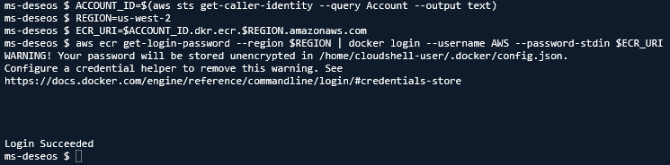
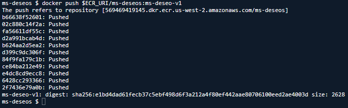
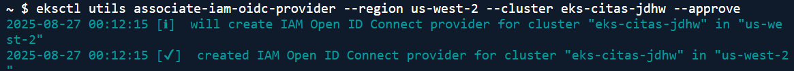
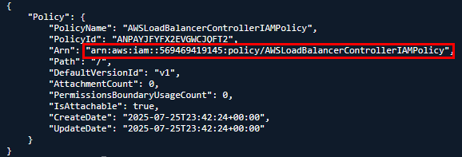
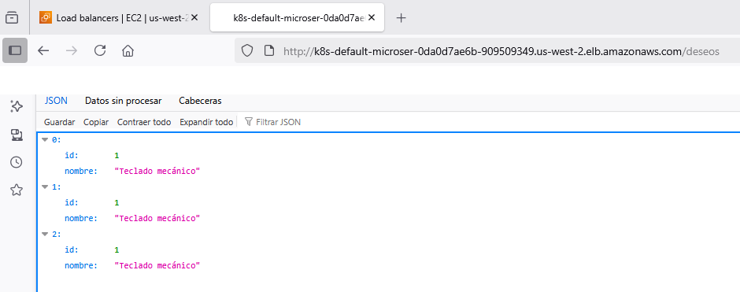

# Práctica 5: Implementación de Ingress Controller con ALB en Amazon EKS

## Objetivo 

Exponer múltiples microservicios en Amazon EKS utilizando un Ingress Controller basado en AWS ALB, permitiendo el enrutamiento por paths. Se implementarán dos microservicios (`ms-productos` y `ms-deseos`) que se comunican entre sí, y se configurará un Ingress para manejarlos mediante un único punto de entrada HTTP.

## Requisitos  

- `kubectl` configurado
- Helm y AWS CLI disponibles (desde AWS CloudShell)
- AWS Load Balancer Controller instalado

## Duración aproximada  

- 60 minutos

## Región de AWS  

- us-west-2 (Oregón)

## Introducción  

Kubernetes permite exponer servicios internos mediante Ingress. En Amazon EKS, el AWS Load Balancer Controller utiliza un ALB (Application Load Balancer) para procesar recursos Ingress. Esta práctica configura el ALB y enruta tráfico a dos microservicios mediante paths distintos.

---

**[⬅️ Atrás](https://netec-mx.github.io/MICR_INT_Priv/Capítulo4/lab4.html)** | **[Lista General](https://netec-mx.github.io/MICR_INT_Priv/)** | **[Siguiente ➡️](https://netec-mx.github.io/MICR_INT_Priv/Capítulo5/lab6.html)**

---

## Instrucciones

### Tarea 1: Iniciar sesión en la consola AWS

**Descripción:** Acceder como usuario IAM.

#### Tarea 1.1

- **Paso 1.** Ir a [AWS Console](https://aws.amazon.com/console)

- **Paso 2.** Clic en **Sign in**

- **Paso 3.** Iniciar sesión con:

  - Account ID or alias: `Cuenta asignada en el curso`
  - IAM username: `Asignado en el curso`
  - Password: `Asignada en el curso`

- **Paso 4.** Verificar que estás en la región `us-west-2`

    

> **TAREA FINALIZADA**

**Resultado esperado:** Acceso exitoso a la consola

---

### Tarea 2: Crear el clúster de Amazon EKS

**Descripción:** Usaremos `eksctl` para crear un clúster EKS con 2 nodos administrados en `us-west-2`.

#### Tarea 2.1 – Instalación y configuración

- **Paso 5.** Abre **AWS CloudShell** dando clic en el icono te la terminal.

  

- **Paso 6.** Ejecuta los siguientes comandos para descargar e instalar `eksctl`:

  ```bash
  curl --silent --location "https://github.com/weaveworks/eksctl/releases/latest/download/eksctl_$(uname -s)_amd64.tar.gz" | tar xz -C /tmp
  ```

  ---

  ```bash
  sudo mv /tmp/eksctl /usr/local/bin
  ```

- **Paso 7.** Define las variables. Sustituye las letras `xxxx`por tus iniciales o letras y numeros aleatorios.

  ```bash
  CLUSTER_NAME=eks-citas-xxxx
  REGION=us-west-2
  ```

  ---

  

- **Paso 8.** Crea el clúster con nodos administrados, copia y pega el siguiente comando en la terminal AWS CloudShell:

  **IMPORTANTE:** La creación del cluster puede tardar 10 a 15 minutos.

  ```bash
  eksctl create cluster \
    --name $CLUSTER_NAME \
    --region $REGION \
    --nodegroup-name worker-nodes \
    --node-type t3.small \
    --nodes 2 \
    --managed
  ```

  ---

  

  **NOTA:** Recuerda que el cluster puede tardar de **10 a 15 minutos**

> **TAREA FINALIZADA**

**Resultado esperado:** Cluster creado y configurado correctamente.

---

### Tarea 3: Crear la estructura del proyecto y microservicios

**Descripción:** Crear dos microservicios que se comunicarán entre sí: `ms-productos` (provee productos) y `ms-deseos` (consume productos y agrega deseos).

#### Tarea 3.1 – Crear directorios base

- **Paso 9.** En AWS CloudShell, crea el directorio base del proyecto y navega dentro de él:

  ```bash
  mkdir proyecto-ingress && cd proyecto-ingress
  ```

- **Paso 10.** Crea las carpetas para los dos microservicios:

  ```bash
  mkdir ms-productos ms-deseos
  ```

#### Tarea 3.2 – Crear el microservicio `ms-productos`

- **Paso 11.** Navega a la carpeta `ms-productos`:
  
  ```bash
  cd ms-productos
  ```

- **Paso 12.** Crea el archivo `app.js` con el siguiente contenido:

  - Crea el archivo llamado: `touch app.js`
  - Edita el archivo con nano u otro editor: `nano app.js`
  - Pega el contenido yaml.
  - Para salir del editor ejecuta `CTRL + O` Enter y `CTRL + X`

  ```js
  const express = require('express');
  const app = express();
  const port = 3001;

  const productos = [
    { id: 1, nombre: 'Teclado mecánico' },
    { id: 2, nombre: 'Monitor 27 pulgadas' }
  ];

  app.get('/productos', (req, res) => {
    res.json(productos);
  });

  app.listen(port, () => {
    console.log(`Servicio de productos en puerto ${port}`);
  });
  ```

- **Paso 13.** Crea `package.json`:

  - Crea el archivo llamado: `touch package.json`
  - Edita el archivo con nano u otro editor: `nano package.json`
  - Pega el contenido yaml.
  - Para salir del editor ejecuta `CTRL + O` Enter y `CTRL + X`
  
  ```json
  {
    "name": "ms-productos",
    "version": "1.0.0",
    "main": "app.js",
    "dependencies": {
      "express": "^4.18.2"
    }
  }
  ```

- **Paso 14.** Crea el `Dockerfile`:

  - Crea el archivo llamado: `touch Dockerfile`
  - Edita el archivo con nano u otro editor: `nano Dockerfile`
  - Pega el contenido yaml.
  - Para salir del editor ejecuta `CTRL + O` Enter y `CTRL + X`
  
  ```Dockerfile
  FROM node:18
  WORKDIR /app
  COPY . .
  RUN npm install
  EXPOSE 3001
  CMD ["node", "app.js"]
  ```

- **Paso 15.** Valida escribiendo el comando **`ls`** que muestra los archivos creados previamente.

  

#### Tarea 3.3 – Crear el microservicio `ms-deseos`

- **Paso 16.** Regresa a la raíz y entra a `ms-deseos`:
  
  ```bash
  cd ../ms-deseos
  ```

- **Paso 17.** Crea el archivo `app.js`:

  - Crea el archivo llamado: `touch app.js`
  - Edita el archivo con nano u otro editor: `nano app.js`
  - Pega el contenido yaml.
  - Para salir del editor ejecuta `CTRL + O` Enter y `CTRL + X`

  ```js
  const express = require('express');
  const axios = require('axios');
  const app = express();
  const port = 3002;
  const deseos = [];

  app.get('/deseos', async (req, res) => {
    try {
      const response = await axios.get('http://ms-productos:3001/productos');
      const productos = response.data;
      deseos.push(productos[0]); // Agrega un producto como deseo
      res.json(deseos);
    } catch (error) {
      res.status(500).json({ error: 'No se pudieron obtener los productos' });
    }
  });

  app.listen(port, () => {
    console.log(`Servicio de deseos en puerto ${port}`);
  });
  ```

- **Paso 18.** Crea el `package.json`:

  - Crea el archivo llamado: `touch package.json`
  - Edita el archivo con nano u otro editor: `nano package.json`
  - Pega el contenido yaml.
  - Para salir del editor ejecuta `CTRL + O` Enter y `CTRL + X`

  ```json
  {
    "name": "ms-deseos",
    "version": "1.0.0",
    "main": "app.js",
    "dependencies": {
      "express": "^4.18.2",
      "axios": "^1.6.7"
    }
  }
  ```

- **Paso 19.** Crea el `Dockerfile`:

  - Crea el archivo llamado: `touch Dockerfile`
  - Edita el archivo con nano u otro editor: `nano Dockerfile`
  - Pega el contenido yaml.
  - Para salir del editor ejecuta `CTRL + O` Enter y `CTRL + X`

  ```Dockerfile
  FROM node:18
  WORKDIR /app
  COPY . .
  RUN npm install
  EXPOSE 3002
  CMD ["node", "app.js"]
  ```

- **Paso 20.** Valida escribiendo el comando **`ls`** que muestra los archivos creados previamente.

  

> **TAREA FINALIZADA**

**Resultado esperado:** Dos carpetas (`ms-productos` y `ms-deseos`) con archivos correctamente configurados.

---

### Tarea 4: Crear las imágenes y subir a ECR

**Descripción:** Crear y subir las imágenes de ambos microservicios a AWS ECR.

#### Tarea 4.1 – Crear repositorios en ECR

- **Paso 21.** Ejecuta los siguientes comandos para crear los 2 repositorios:

  ```bash
  aws ecr create-repository --repository-name ms-productos
  ```

  ---

  ```bash
  aws ecr create-repository --repository-name ms-deseos
  ```

- **Paso 22.** Valida la creación ejecutando el siguiente comando.

  ```bash
  aws ecr describe-repositories --query "repositories[*].repositoryName" --output table
  ```

  ---

  

#### Tarea 4.2 – Login en ECR y construir imágenes

- **Paso 23.** Autentícate al servicio de Amazon ECR:

  ```bash
  ACCOUNT_ID=$(aws sts get-caller-identity --query Account --output text)
  REGION=us-west-2
  ECR_URI=$ACCOUNT_ID.dkr.ecr.$REGION.amazonaws.com
  aws ecr get-login-password --region $REGION | docker login --username AWS --password-stdin $ECR_URI
  ```

  ---

  

- **Paso 24.** Construye, etiqueta y sube `ms-productos`. Ejecuta los comandos 1 por 1:

  **NOTA:** Si es necesario ajusta la ruta para entrar al directorio **ms-productos**.

  ```bash
  cd ../ms-productos
  ```

  ---

  ```bash
  docker build -t ms-productos .
  ```

  ---

  ```bash
  docker tag ms-productos $ECR_URI/ms-productos:ms-prod-v1
  ```

  ---

  ```bash
  docker push $ECR_URI/ms-productos:ms-prod-v1
  ```

  

- **Paso 25.** Repite para `ms-deseos`:

  **NOTA:** Si es necesario ajusta la ruta para entrar al directorio **ms-deseos**.

  **IMPORTANTE:** Solo si te llegase a marcar error a causa de almacenamiento de AWS Cloud Shell da clic en **Actions** y luego en **Restart**. Sino continua con la construcciones de la imagen

  - Repite los siguientes pasos para configurar las variables.
  - `ACCOUNT_ID=$(aws sts get-caller-identity --query Account --output text)`
  - `REGION=us-west-2`
  - `ECR_URI=$ACCOUNT_ID.dkr.ecr.$REGION.amazonaws.com`

  ```bash
  cd ./ms-deseos
  ```

  ---

  ```bash
  docker build -t ms-deseos .
  ```

  ---

  ```bash
  docker tag ms-deseos $ECR_URI/ms-deseos:ms-deseo-v1
  ```

  ---

  ```bash
  docker push $ECR_URI/ms-deseos:ms-deseo-v1
  ```

  

> **TAREA FINALIZADA**

**Resultado esperado:** Ambas imágenes están disponibles en ECR.

---

### Tarea 5: Crear los manifiestos de Kubernetes

**Descripción:** Crear los deployments, services e ingress para ambos microservicios.

#### Tarea 5.1 – Crear archivo de despliegue para ms-productos

- **Paso 26.** Primero crea el directorio para almacenar los archivos de kubernetes en la raiz del **proyecto-ingress**

  **NOTA:** Si es necesario ajusta la ruta del directorio.

  ```bash
  mkdir ../manifiestos-k8s
  ```

- **Paso 27.** Valida la creación de la carpeta con el comando `ls` y entra al directorio creado

  

  ---

  ```bash
  cd ../manifiestos-k8s
  ```

- **Paso 28.** Ahora ejecuta los siguientes puntos:

  - Escribe el siguiente comando: `echo $ECR_URI` sino te da resultado vuelve a la **Tarea 4.2**
  - Crea el archivo llamado: `touch deployment-msprod.yaml`
  - Edita el archivo con nano u otro editor: `nano deployment-msprod.yaml`
  - Pega el contenido yaml.
  - Edita la URI del respositorio
  - Para salir del editor ejecuta `CTRL + O` Enter y `CTRL + X`

  ```yaml
  apiVersion: apps/v1
  kind: Deployment
  metadata:
    name: ms-productos
  spec:
    replicas: 1
    selector:
      matchLabels:
        app: ms-productos
    template:
      metadata:
        labels:
          app: ms-productos
      spec:
        containers:
        - name: ms-productos
          image: <ECR_URI>/ms-productos:ms-prod-v1
          ports:
          - containerPort: 3001
  ---
  apiVersion: v1
  kind: Service
  metadata:
    name: ms-productos
  spec:
    selector:
      app: ms-productos
    ports:
    - port: 3001
      targetPort: 3001
    type: ClusterIP
  ```

#### Tarea 5.2 – Crear archivo de despliegue para ms-deseos

- **Paso 29.** Ejecuta los siguientes puntos:

  - Crea el archivo llamado: `touch deployment-msdeseos.yaml`
  - Edita el archivo con nano u otro editor: `nano deployment-msdeseos.yaml`
  - Pega el contenido yaml.
  - Edita la URI del respositorio
  - Para salir del editor ejecuta `CTRL + O` Enter y `CTRL + X`

  ```yaml
  apiVersion: apps/v1
  kind: Deployment
  metadata:
    name: ms-deseos
  spec:
    replicas: 1
    selector:
      matchLabels:
        app: ms-deseos
    template:
      metadata:
        labels:
          app: ms-deseos
      spec:
        containers:
        - name: ms-deseos
          image: <ECR_URI>/ms-deseos:ms-deseo-v1
          ports:
          - containerPort: 3002
  ---
  apiVersion: v1
  kind: Service
  metadata:
    name: ms-deseos
  spec:
    selector:
      app: ms-deseos
    ports:
    - port: 3002
      targetPort: 3002
    type: ClusterIP
  ```

> **TAREA FINALIZADA**

**Resultado esperado:** Archivo listo para desplegar ambos servicios.

---

### Tarea 6: Instalar el ALB Ingress Controller

**Descripción:** Instalar el ALB Controller que te permitira interactuar con el ingress.

#### Tarea 6.1 – Crear el IAM OIDC provider

- **Paso 30.** Primero verifica si ya existe:

  **NOTA:** Regresa a la **Tarea 2.1** para instalar **eksctl**. Cambia las letras `x` al nombre de tu cluster.

  ```bash
  eksctl utils associate-iam-oidc-provider --region us-west-2 --cluster eks-citas-xxxx --approve
  ```

  ---

  

#### Tarea 6.2 – Crear la política de IAM

- **Paso 31.** Descarga la política de IAM oficial desde AWS

  ```bash
  curl -o iam-policy.json https://raw.githubusercontent.com/kubernetes-sigs/aws-load-balancer-controller/main/docs/install/iam_policy.json
  ```

- **Paso 32.** Crea una política de IAM personalizada en tu cuenta

  ```bash
  aws iam create-policy \
    --policy-name AWSLoadBalancerControllerIAMPolicy \
    --policy-document file://iam-policy.json
  ```

  ---

  

- **Paso 33.** Del resultado de la politica guarda el valor de **Arn** en un bloc de notas, lo usaras mas adelante.

  

#### Tarea 6.3 – Crear el ServiceAccount con IRSA

- **Paso 34.** Crea un ServiceAccount con esa política asociada (IRSA). sustituye los siguientes valores.

  - Pasa el siguiente comando a tu editor de texto.
  - Sustituye las letras `x`por las de tu cluster.
  - Cambia el valor `<POLITICA-ARN>` por el que guardaste, sin las comillas dobles.
  - Ejecutalo en la terminal de AWS Cloud Shell.

  ```bash
  eksctl create iamserviceaccount \
    --cluster eks-citas-xxxx \
    --region us-west-2 \
    --namespace kube-system \
    --name aws-load-balancer-controller \
    --attach-policy-arn <POLITICA_ARN> \
    --approve
  ```

- **Paso 35.** Espera de 30 segundos a 2 minutos y veras el resultado exitoso en la terminal.

  

- **Paso 36.** Verifica que el ServiceAccount tenga el rol asociado, ejecuta el siguiente comando.

  ```bash
  kubectl -n kube-system get sa aws-load-balancer-controller -o yaml
  ```

  ---

  

#### Tarea 6.4 – Aplicar permisos RBAC correctos

- **Paso 37.** Aplica el `ClusterRole` con permisos completos:

  ```bash
  kubectl apply -f - <<EOF
  apiVersion: rbac.authorization.k8s.io/v1
  kind: ClusterRole
  metadata:
    name: aws-load-balancer-controller-role
  rules:
    - apiGroups: [""]
      resources: [configmaps, endpoints, events, nodes, pods, secrets, services, namespaces]
      verbs: [create, get, list, update, watch, patch]
    - apiGroups: ["extensions", "networking.k8s.io"]
      resources: [ingresses, ingresses/status]
      verbs: [create, get, list, update, watch, patch]
    - apiGroups: ["networking.k8s.io"]
      resources: [ingressclasses]
      verbs: [get, list, watch]
    - apiGroups: ["elbv2.k8s.aws"]
      resources: [targetgroupbindings, targetgroupbindings/status, ingressclassparams]
      verbs: [create, get, list, watch, update, patch, delete]
    - apiGroups: ["coordination.k8s.io"]
      resources: [leases]
      verbs: [get, list, watch, create, update]
  EOF
  ```

- **Paso 38.** Aplica el `ClusterRoleBinding` correspondiente:

  ```bash
  kubectl apply -f - <<EOF
  apiVersion: rbac.authorization.k8s.io/v1
  kind: ClusterRoleBinding
  metadata:
    name: aws-load-balancer-controller-binding
  roleRef:
    apiGroup: rbac.authorization.k8s.io
    kind: ClusterRole
    name: aws-load-balancer-controller-role
  subjects:
    - kind: ServiceAccount
      name: aws-load-balancer-controller
      namespace: kube-system
  EOF
  ```

#### Tarea 6.5 – Crear el Secret TLS

- **Paso 39.** Crea los certificados TLS

  ```bash
  openssl req -x509 -nodes -days 365 -newkey rsa:2048 \
  -subj "/CN=webhook.aws-load-balancer.local" \
  -keyout tls.key -out tls.crt
  ```

- **Paso 40.** Crea el Secret con los certificados

  ```bash
  kubectl create secret tls aws-load-balancer-webhook-tls \
  --cert=tls.crt \
  --key=tls.key \
  -n kube-system
  ```

#### Tarea 6.6 – Aplicar los CRDs requeridos

- **Paso 41.** Aplica los CRDs obligatorios

  ```bash
  kubectl apply -f https://raw.githubusercontent.com/kubernetes-sigs/aws-load-balancer-controller/v2.6.2/config/crd/bases/elbv2.k8s.aws_targetgroupbindings.yaml
  ```
  
  ---

  ```bash
  kubectl apply -f https://raw.githubusercontent.com/kubernetes-sigs/aws-load-balancer-controller/v2.6.2/config/crd/bases/elbv2.k8s.aws_ingressclassparams.yaml
  ```

#### Tarea 6.7 – Crear el IngressClass antes del Ingress

- **Paso 42.** Crear una carpeta para organizar los manifiestos

  ```bash
  mkdir alb-controller && cd alb-controller
  ```

- **Paso 43.** Crea el ingress class con el siguiente comando.

  ```bash
  kubectl apply -f - <<EOF
  apiVersion: networking.k8s.io/v1
  kind: IngressClass
  metadata:
    name: alb
  spec:
    controller: ingress.k8s.aws/alb
  EOF
  ```

#### Tarea 6.8 – Crear el manifiesto del ALB Controller

- **Paso 44.** Crea el archivo completo `alb-controller.yaml`

  ```bash
  nano alb-controller.yaml
  ```

- **Paso 45.** Pega el siguiente contenido COMPLETO:

  - Identifica la siguiente ruta (Jerarquia de etiquetas) del archivo: `kind:Deployment/spec/template/spec/container/args`
  - Sustituye las letras `x` del nombre de tu cluster `--cluster-name`.
  - Guarda con `Ctrl + o`, Enter, y luego `Ctrl + x`.

  ```yaml
  # alb-controller.yaml
  ---
  apiVersion: v1
  kind: ServiceAccount
  metadata:
    name: aws-load-balancer-controller
    namespace: kube-system
    labels:
      app.kubernetes.io/name: aws-load-balancer-controller
      app.kubernetes.io/component: controller
  ---
  apiVersion: apps/v1
  kind: Deployment
  metadata:
    name: aws-load-balancer-controller
    namespace: kube-system
  spec:
    replicas: 1
    selector:
      matchLabels:
        app.kubernetes.io/name: aws-load-balancer-controller
        app.kubernetes.io/component: controller
    template:
      metadata:
        labels:
          app.kubernetes.io/name: aws-load-balancer-controller
          app.kubernetes.io/component: controller
      spec:
        serviceAccountName: aws-load-balancer-controller
        containers:
          - name: controller
            image: public.ecr.aws/eks/aws-load-balancer-controller:v2.6.2
            args:
              - --cluster-name=eks-citas-xxxx   # <--- Sustituye este valor
              - --ingress-class=alb
              - --aws-region=us-west-2
              - --webhook-cert-dir=/tmp/k8s-webhook-server/serving-certs
              - --enable-leader-election
            ports:
              - name: webhook-server
                containerPort: 9443
                protocol: TCP
            volumeMounts:
              - name: webhook-cert
                mountPath: /tmp/k8s-webhook-server/serving-certs
                readOnly: true
        volumes:
          - name: webhook-cert
            secret:
              secretName: aws-load-balancer-webhook-tls

  ```

- **Paso 46.** Aplica el manifiesto

  ```bash
  kubectl apply -f alb-controller.yaml
  ```

#### Tarea 6.9 – Validar el estado del controlador

- **Paso 47.** Verifica que el Pod está en estado Running

  ```bash
  kubectl get pods -n kube-system -l app.kubernetes.io/name=aws-load-balancer-controller
  ```

  ---

  

- **Paso 48.** Verifica los logs del pod

  ```bash
  kubectl logs -n kube-system -l app.kubernetes.io/name=aws-load-balancer-controller
  ```

  ---

  

> **TAREA FINALIZADA**

**Resultado esperado:** ALB Controller instalado.

---

### Tarea 7: Crear el Ingress

**Descripción** Exponer los microservicios `ms-productos` y `ms-deseos` mediante rutas específicas utilizando el AWS Load Balancer Controller (ALB).

#### Tarea 7.1 – Crear manifiestos de los microservicios

- **Paso 49.** Despliega los siguientes archivos de los microservicios.

  - `deployment-msprod.yaml` para `ms-productos`
  - `deployment-msdeseos.yaml` para `ms-deseos`

  **NOTA:** Si es necesario ajusta las rutas para ejecutar los archivos.

  ```bash
  kubectl apply -f ../deployment-msprod.yaml
  kubectl apply -f ../deployment-msdeseos.yaml
  ```

#### Tarea 7.2 – Crear archivo `ingress.yaml`

- **Paso 50.** Configura lo siguiente:

  - Crea el archivo llamado: `touch ingress.yaml`
  - Edita el archivo con nano u otro editor: `nano ingress.yaml`
  - Pega el contenido yaml.
  - Para salir del editor ejecuta `CTRL + O` Enter y `CTRL + X`

  ```yaml
  apiVersion: networking.k8s.io/v1
  kind: Ingress
  metadata:
    name: microservicios-ingress
    annotations:
      alb.ingress.kubernetes.io/scheme: internet-facing
      alb.ingress.kubernetes.io/target-type: ip
      alb.ingress.kubernetes.io/listen-ports: '[{"HTTP": 80}]'
  spec:
    ingressClassName: alb
    rules:
      - http:
          paths:
            - path: /productos
              pathType: Prefix
              backend:
                service:
                  name: ms-productos
                  port:
                    number: 3001
            - path: /deseos
              pathType: Prefix
              backend:
                service:
                  name: ms-deseos
                  port:
                    number: 3002
  ```

#### Tarea 7.3 – Aplicar el ingress

- **Paso 51.** Ejecuta el siguiente comando para crear el ingress.

  **NOTA:** Si es necesario ajusta las rutas para ejecutar los archivos.

  ```bash
  kubectl apply -f ingress.yaml
  ```

#### Tarea 7.4 – Validar los despliegues

- **Paso 52.** Verifica los pods creados correctamente.

  ```bash
  kubectl get pods
  ```

  ---

  

- **Paso 53.** Verifica que los Services estén creados:

  ```bash
  kubectl get svc
  ```

  ---

  

- **Paso 54.** Verifica el estado del Ingress, espera 2 minutos y ejecuta la verificacion.

  ```bash
  kubectl get ingress -w
  ```

  ---

  

> **TAREA FINALIZADA**

**Resultado esperado:** Pods correctamente desplegados.

---

### Tarea 8: Validar funcionamiento

- **Paso 55.** Copia la dirección del ALB y prueba en navegador:

  - `http://<ALB>/productos` → lista productos
  - `http://<ALB>/deseos` → añade productos a deseos y muestra lista

  

  ---

  

> **TAREA FINALIZADA**

**Resultado esperado:** El navegador debe responder con JSON de ambos servicios desde rutas diferentes.

---

> **¡FELICIDADES HAZ COMPLETADO EL LABORATORIO 5!**

---

## Resultado final

Dos microservicios interdependientes desplegados en Amazon EKS, accesibles por paths únicos a través de un ALB Ingress Controller. La arquitectura está preparada para escalar, integrar nuevas rutas y aplicar seguridad TLS.

## Notas y Consideraciones

- Verifica que el ALB esté en estado **activo** desde la consola EC2 → Load Balancers.
- Los logs se pueden visualizar con:
  ```bash
  kubectl logs deploy/ms-productos
  kubectl logs deploy/ms-deseos
  ```

## URLs de referencia

- https://docs.aws.amazon.com/eks/latest/userguide/aws-load-balancer-controller.html
- https://kubernetes.io/docs/concepts/services-networking/ingress/

---

**[⬅️ Atrás](https://netec-mx.github.io/MICR_INT_Priv/Capítulo4/lab4.html)** | **[Lista General](https://netec-mx.github.io/MICR_INT_Priv/)** | **[Siguiente ➡️](https://netec-mx.github.io/MICR_INT_Priv/Capítulo5/lab6.html)**