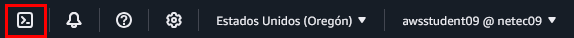
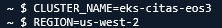
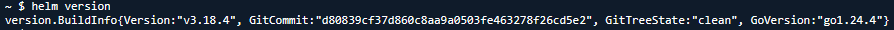

# Práctica 6: Monitoreo con Prometheus y Grafana en Amazon EKS

## Objetivo  

Implementar un sistema de monitoreo completo en un clúster de Amazon EKS utilizando Prometheus para recolectar métricas y Grafana para visualizar datos en tiempo real de los microservicios `ms-productos` y `ms-deseos`.

## Requisitos  

- Servicios `ms-productos` y `ms-deseos`
- Acceso a AWS CloudShell

## Duración aproximada  

- 60 minutos

## Región de AWS 

- us-west-2 (Oregón)

## Introducción

Prometheus es una herramienta de recolección de métricas ampliamente utilizada en entornos Kubernetes. Grafana permite construir dashboards para visualizar estas métricas. Esta práctica instala ambos servicios en EKS y los conecta a microservicios existentes para observar su comportamiento.

---

**[⬅️ Atrás](https://netec-mx.github.io/MICR_INT_Priv/Capítulo4/lab5.html)** | **[Lista General](https://netec-mx.github.io/MICR_INT_Priv/)** | **[Siguiente ➡️](https://netec-mx.github.io/MICR_INT_Priv/Capítulo1/lab1.html)**

---

## Instrucciones

### Tarea 1: Iniciar sesión en la consola AWS

**Descripción:** Acceder como usuario IAM.

#### Tarea 1.1

- **Paso 1.** Ir a [AWS Console](https://aws.amazon.com/console)

- **Paso 2.** Clic en **Sign in**

- **Paso 3.** Iniciar sesión con:

  - Account ID or alias: `Cuenta asignada en el curso`
  - IAM username: `Asignado en el curso`
  - Password: `Asignada en el curso`

- **Paso 4.** Verificar que estás en la región `us-west-2`

    

> **TAREA FINALIZADA**

**Resultado esperado:** Acceso exitoso a la consola

---

### Tarea 2: Crear el clúster de Amazon EKS

**Descripción:** Usaremos `eksctl` para crear un clúster EKS con 2 nodos administrados en `us-west-2`.

#### Tarea 2.1 – Instalación y configuración

- **Paso 5.** Abre **AWS CloudShell** dando clic en el icono te la terminal.

  

- **Paso 6.** Ejecuta los siguientes comandos para descargar e instalar `eksctl`:

  ```bash
  curl --silent --location "https://github.com/weaveworks/eksctl/releases/latest/download/eksctl_$(uname -s)_amd64.tar.gz" | tar xz -C /tmp
  ```

  ---

  ```bash
  sudo mv /tmp/eksctl /usr/local/bin
  ```

- **Paso 7.** Define las variables. Sustituye las letras `xxxx`por tus iniciales o letras y numeros aleatorios.

  ```bash
  CLUSTER_NAME=eks-citas-xxxx
  REGION=us-west-2
  ```

  ---

  

- **Paso 8.** Crea el clúster con nodos administrados, copia y pega el siguiente comando en la terminal AWS CloudShell:

  **IMPORTANTE:** La creación del cluster puede tardar 10 a 15 minutos.

  ```bash
  eksctl create cluster \
    --name $CLUSTER_NAME \
    --region $REGION \
    --nodegroup-name worker-nodes \
    --node-type t3.small \
    --nodes 2 \
    --managed
  ```

  ---

  

  **NOTA:** Recuerda que el cluster puede tardar de **10 a 15 minutos**

> **TAREA FINALIZADA**

**Resultado esperado:** Cluster creado y configurado correctamente.

---

### Tarea 3: Verificar entorno base

**Descripción:** Asegurarse de que el clúster esté activo y se tenga acceso con `kubectl`.

#### Tarea 3.1 – Validar conexión con EKS

- **Paso 9.** En AWS CloudShell, lista los nodos:

  ```bash
  kubectl get nodes
  ```
  
  ---

  

> **TAREA FINALIZADA**

**Resultado esperado:** Debes ver al menos dos nodos en estado `Ready`.

---

### Tarea 4: Instalar Helm en AWS CloudShell

**Descripción:** AWS CloudShell no tiene Helm por defecto, se instalará manualmente.

#### Tarea 4.1 – Descargar Helm

- **Paso 10.** Ejecuta:

  ```bash
  curl https://raw.githubusercontent.com/helm/helm/main/scripts/get-helm-3 | bash
  ```

  ---

  

#### Tarea 4.2 – Verificar instalación

- **Paso 11.** Ejecuta:

  ```bash
  helm version
  ```

  ---

  

> **TAREA FINALIZADA**

**Resultado esperado:** Helm v3 aparece instalado correctamente (por ejemplo, `version.BuildInfo{Version:"v3.13.x"}`).

---

### Tarea 5: Instalar Prometheus con Helm

**Descripción:** Usar Helm para instalar Prometheus en el namespace `monitoring`.

#### Tarea 5.1 – Crear namespace y configuración

- **Paso 12.** Ejecuta:

  ```bash
  kubectl create namespace monitoring
  ```

- **Paso 13.** Crear archivo `prometheus-values.yaml`:

  ```bash
  nano prometheus-values.yaml
  ```

- **Paso 14.** Pega el siguiente contenido en el archivo:

  ```yaml
  alertmanager:
    persistentVolume:
      enabled: false
    service:
      type: LoadBalancer

  server:
    persistentVolume:
      enabled: false
    service:
      type: LoadBalancer

  pushgateway:
    persistentVolume:
      enabled: false
  ```

- **Paso 15.** Guarda el archivo con `Ctrl + O`, `Enter`, y cierra con `Ctrl + X`.

#### Tarea 5.2 – Agregar repositorio de Helm

- **Paso 16.** Agrega el repo oficial:

  ```bash
  helm repo add prometheus-community https://prometheus-community.github.io/helm-charts
  helm repo update
  ```

  ---

  

#### Tarea 5.3 – Instalar Prometheus

- **Paso 17.** Instala Prometheus en el namespace `monitoring`:

  **NOTA:** La salida es mas extensa, la imagen de abajo es representativa.

  ```bash
  helm install prometheus prometheus-community/prometheus \
    --namespace monitoring \
    -f prometheus-values.yaml
  ```

  ---

  

#### Tarea 5.4 – Validar instalación

- **Paso 18.** Verifica que los pods estén en `Running`:

  **NOTA:** Es normal ver `alertmanager` en estatus **Pending** no se usara en esta practica. **Los pods pueden tardar de 1 a 2 minutos.**

  ```bash
  kubectl get pods -n monitoring
  ```
  
  ---

  

- **Paso 19.** Verifica que se asignó una IP Externa:

  ```bash
  kubectl get svc -n monitoring prometheus-server
  ```

  ---

  

- **Paso 20.** Copia el DNS publico y pegalo en una pestaña de tu navegador para verificar el entorno gráfico.

  

> **TAREA FINALIZADA**

**Resultado esperado:** Pods como `prometheus-server`, `prometheus-node-exporter` en estado `Running`, y verificación grafica de prometheus.

---

### Tarea 6: Instalar Grafana con Helm

**Descripción:** Desplegar Grafana en el mismo namespace para construir dashboards de monitoreo.

#### Tarea 6.1 – Instalar Grafana

- **Paso 21.** Agrega los repositorios adecuados de Grafana pra Helm

  ```bash
  helm repo add grafana https://grafana.github.io/helm-charts
  helm repo update
  ```

- **Paso 22.** Ahora instala Grafana, ejecuta:

  ```bash
  helm install grafana grafana/grafana \
    --namespace monitoring \
    --set adminPassword='Netec2025' \
    --set service.type=LoadBalancer
  ```

  ---

  

  **NOTA:** `admin` es el usuario por defecto y contraseña `Netec2025` definida en el comando.

#### Tarea 6.2 – Validar acceso a Grafana

- **Paso 23.** Espera 1-2 minutos y luego verifica con el siguiente comando:

  ```bash
  kubectl get svc -n monitoring
  ```

  ---

  

- **Paso 24.** Copia la IP Externa y abre una pestaña adicional en el navegador:

  ```
  http://<EXTERNAL-IP>
  ```

  ---

  

- **Paso 25.** Inicia sesión con:

  - Usuario: `admin`
  - Contraseña: `Netec2025`

  ---

  

> **TAREA FINALIZADA**

**Resultado esperado:** Acceso al dashboard de Grafana desde IP Externa, sin necesidad de tunelado

---

### Tarea 7: Conectar Prometheus como fuente de datos en Grafana

**Descripción:** Configurar Prometheus como fuente de datos en la interfaz de Grafana.

#### Tarea 7.1 – Obtener URL de Prometheus

- **Paso 26.** En AWS CloudShell ejecuta:

  ```bash
  kubectl get svc -n monitoring
  ```

- **Paso 27.** Verifica que el nombre del servicio sea `prometheus-server` en la columna **Name**.

#### Tarea 7.2 – Agregar en Grafana

- **Paso 28.** En la pestaña que tienes abierta de Grafana haz lo siguiente:

  - Ir a **Connections** → **Data Sources**
  - Clic en **Add data source**
  - Selecciona **Prometheus**
  - En `Prometheus server URL` escribe:

  ```
  http://prometheus-server.monitoring.svc.cluster.local
  ```
  
- **Paso 29.** Clic en **Save & Test** al final de la pagina.

  

> **TAREA FINALIZADA**

**Resultado esperado:** Mensaje verde "Successfully queried the Prometheus API."

---

### Tarea 8: Agregar métricas de los microservicios

**Descripción:** Habilitar endpoints `/metrics` en los servicios `ms-productos` y `ms-deseos` usando `prom-client`.

#### Tarea 8.1 – Modificar código de `ms-productos`

- **Paso 30.** Agrega la librería `prom-client` a `ms-productos/`:

  ```bash
  cd proyecto-ingress
  cd ms-productos
  npm install prom-client
  ```

- **Paso 31.** Modifica `app.js`:

  - Edita el archivo existente, escribe: `nano app.js`
  - Borra el codigo actual.
  - Agrega el siguiene codigo.
  - Terminado de editar escribr: `CTRL + O` y `Enter` para guardar `CTRL + X` para salir.

  ```js
  const express = require('express');
  const promClient = require('prom-client');
  const app = express();
  const port = 3001;

  promClient.collectDefaultMetrics({
    labels: { servicio: 'ms-productos' }
  });


  const productos = [
    { id: 1, nombre: 'Teclado mecánico' },
    { id: 2, nombre: 'Monitor 27 pulgadas' }
  ];

  app.get('/productos', (req, res) => {
    res.json(productos);
  });

  app.get('/metrics', async (req, res) => {
    res.set('Content-Type', promClient.register.contentType);
    res.end(await promClient.register.metrics());
  });

  app.listen(port, () => {
    console.log(`Servicio de productos en puerto ${port}`);
  });
  ```

- **Paso 32.** Construye la imagen.

  ```bash
  docker build -t ms-productos .
  ```

- **Paso 33.** Autentícate al servicio de Amazon ECR:

  ```bash
  ACCOUNT_ID=$(aws sts get-caller-identity --query Account --output text)
  REGION=us-west-2
  ECR_URI=$ACCOUNT_ID.dkr.ecr.$REGION.amazonaws.com
  aws ecr get-login-password --region $REGION | docker login --username AWS --password-stdin $ECR_URI
  ```

- **Paso 34.** Sube la imagen a ECR al mismo repositorio del laboratorio 5.

  ```bash
  docker tag ms-productos $ECR_URI/ms-productos:ms-prod-v2
  docker push $ECR_URI/ms-productos:ms-prod-v2
  ```

- **Paso 35.** Ya que se haya subido la imagen desetiqueta y eliminala de AWS CloudShell ya que no tiene suficiente espacio. Se liberara para construir `ms-deseos`

  ```bash
  docker rmi $ECR_URI/ms-productos:ms-prod-v2
  docker rmi ms-productos
  ```

- **Paso 36.** Reinicia el shell pra que tome efecto da clic en **Actions** luego en **Restart**.

#### Tarea 8.2 – Repetir para `ms-deseos`

- **Paso 37.** Repite el mismo procedimiento para `ms-deseos` agregando `/metrics`.

- **Paso 38.** Agrega la librería `prom-client` a `ms-deseos/`:

  ```bash
  cd proyecto-ingress
  cd ms-deseos
  npm install prom-client
  ```

- **Paso 39.** Modifica `app.js`:

  - Edita el archivo existente, escribe: `nano app.js`
  - Borra el codigo actual.
  - Agrega el siguiene codigo.
  - Terminado de editar escribr: `CTRL + O` y `Enter` para guardar `CTRL + X` para salir.

  ```js
  const express = require('express');
  const axios = require('axios');
  const promClient = require('prom-client');
  const app = express();
  const port = 3002;
  const deseos = [];

  promClient.collectDefaultMetrics({
    labels: { servicio: 'ms-deseos' }
  });

  app.get('/deseos', async (req, res) => {
    try {
      const response = await axios.get('http://ms-productos:3001/productos');
      const productos = response.data;
      deseos.push(productos[0]); // Agrega un producto como deseo
      res.json(deseos);
    } catch (error) {
      res.status(500).json({ error: 'No se pudieron obtener los productos' });
    }
  });

  app.get('/metrics', async (req, res) => {
    res.set('Content-Type', promClient.register.contentType);
    res.end(await promClient.register.metrics());
  });

  app.listen(port, () => {
    console.log(`Servicio de deseos en puerto ${port}`);
  });
  ```

- **Paso 40.** Construye la imagen.

  ```bash
  docker build -t ms-deseos .
  ```

- **Paso 41.** Autentícate al servicio de Amazon ECR:

  ```bash
  ACCOUNT_ID=$(aws sts get-caller-identity --query Account --output text)
  REGION=us-west-2
  ECR_URI=$ACCOUNT_ID.dkr.ecr.$REGION.amazonaws.com
  aws ecr get-login-password --region $REGION | docker login --username AWS --password-stdin $ECR_URI
  ```

- **Paso 42.** Sube la imagen a ECR al mismo repositorio del laboratorio 5.

  ```bash
  docker tag ms-deseos $ECR_URI/ms-deseos:ms-deseo-v2
  docker push $ECR_URI/ms-deseos:ms-deseo-v2
  ```

- **Paso 43.** Ahora edita correctamente los archivos deployments para ajustar la imagen creada.

  ```bash
  cd ../manifiestos-k8s
  nano deployment-msprod.yaml
  ```

- **Paso 44.** Ajusta el valor de la imagen de `ms-prod-v1` a `ms-prod-v2`

  **NOTA:** `CTRL + O` y `Enter` para guardar `CTRL + X` para salir.

- **Paso 45.** Ahora crea el archivo service para actualizarlo con las metricas correspondientes.

  - Crea el archivo llamado: `nano ms-productos-service.yaml`
  - Agrega el siguiene codigo.
  - Terminado de editar escribr: `CTRL + O` y `Enter` para guardar `CTRL + X` para salir.

  ```yaml
  apiVersion: v1
  kind: Service
  metadata:
    name: ms-productos
    namespace: default
    labels:
      app: ms-productos
    annotations:
      prometheus.io/scrape: "true"
      prometheus.io/path: "/metrics"
      prometheus.io/port: "3001"
  spec:
    selector:
      app: ms-productos
    ports:
      - name: http
        protocol: TCP
        port: 3001
        targetPort: 3001
  ```

- **Paso 46.** Repite para **ms-deseos** cambia el valor de la imagen de `ms-deseo-v1` a `ms-deseo-v2`

  **NOTA:** `CTRL + O` y `Enter` para guardar `CTRL + X` para salir.

  ```bash
  nano deployment-msdeseos.yaml
  ```

- **Paso 47.** Ahora crea el archivo service para actualizarlo con las metricas correspondientes.

  - Crea el archivo llamado: `nano ms-deseos-service.yaml`
  - Agrega el siguiene codigo.
  - Terminado de editar escribr: `CTRL + O` y `Enter` para guardar `CTRL + X` para salir.

  ```yaml
  apiVersion: v1
  kind: Service
  metadata:
    name: ms-deseos
    namespace: default
    labels:
      app: ms-deseos
    annotations:
      prometheus.io/scrape: "true"
      prometheus.io/path: "/metrics"
      prometheus.io/port: "3002"
  spec:
    selector:
      app: ms-deseos
    ports:
      - name: http
        protocol: TCP
        port: 3002
        targetPort: 3002
  ```

- **Paso 48.** Despliega los manifiestos con los ajustes.

  ```bash
  kubectl apply -f deployment-msprod.yaml
  kubectl apply -f deployment-msdeseos.yaml
  kubectl apply -f ms-productos-service.yaml
  kubectl apply -f ms-deseos-service.yaml
  ```

> **TAREA FINALIZADA**

**Resultado esperado:** Codigo ajustado correctamente y manifiestos aplicados sin errores.

---

### Tarea 9: Validar monitoreo desde Grafana

**Descripción:** Crear un panel en Grafana para visualizar métricas de uso.

#### Tarea 9.1 – Crear dashboard personalizado

- **Paso 49.** Entra a Grafana que dejaste abrieta en la **Tarea 6** sino regresa a esa tarea. Dentro de Grafana da clic en:

  - Clic en **Dashboards** → **+ Create dashboard**
  - Luego en **+ Add visualization**
  - Selecciona **prometheus**

- **Paso 50.** Ahora agrega el filtro para visualizarlo en la grafica.

  **NOTA:** Si no aparece de inmediato actualiza la pantalla y vuelve a crear el filtro.

  - En la opción **Metric** escribe: `process_cpu_user_seconds_total`
  - En la opción **Label filters** selecciona: `service = ms-productos`
  - Da clic en **Run queries**.
  - En **Title** de **Panel options** lateral derecho escribe el nombre: `CPU ms-productos`

  

- **Paso 51.** Da clic en la opción **Save dashboard** que aparece en la esquina superior derecha.

- **Paso 52.** Escribe los siguientes datos.

  - En **Title** agrega: `CPU Dashboard`
  - En **Description** agrega: `Dashboard de CPU de Microservicios`
  - Clic en **Save**

- **Paso 53.** Ahora haz los siguientes pasos para agregar **ms-deseos**.

  - Clic en el menu lateral izquierdo **Dashboards**.
  - Clic en el nombre del dashboard **CPU Dashboard**
  - Clic en el botón **Add** lateral superior izquierdo.
  - Selecciona **Visualization**

- **Paso 54.** Repite los pasos para agregar la metrica.

  - En la opción **Metric** escribe: `process_cpu_user_seconds_total`
  - En la opción **Label filters** selecciona: `service = ms-deseos`
  - Da clic en **Run queries**.
  - En **Title** de **Panel options** lateral derecho escribe el nombre: `CPU ms-deseos`

  

- **Paso 55.** Da clic en la opción **Save dashboard** que aparece en la esquina superior derecha y da clic en **Save**.

- **Paso 56.** Clic en el menu lateral izquierdo **Dashboards** y luego en **CPU Dashboard**

- **Paso 57.** Observaras los 2 widgets creados.

  

> **TAREA FINALIZADA**

**Resultado esperado:** Se visualiza gráfica con el uso de CPU de cada microservicio.

---

> **¡FELICIDADES HAZ COMPLETADO EL LABORATORIO 6!**

---

## Resultado final 

Prometheus recolecta métricas de los microservicios, y Grafana permite visualizarlas en tiempo real. El entorno está listo para monitorear comportamiento, uso de CPU de los pods.

---

## Notas y/o Consideraciones

- Puedes importar dashboards prehechos desde [grafana.com/dashboards](https://grafana.com/grafana/dashboards/)
- Puedes verificar el endpoint `/metrics`:

  ```
  kubectl port-forward svc/ms-productos 3001:3001
  curl http://localhost:3001/metrics
  curl http://localhost:3001/productos
  ```

- Usa también:

  ```
  kubectl port-forward svc/ms-deseos 3002:3002
  curl http://localhost:3002/metrics
  curl http://localhost:3002/deseos
  ```

## URLs de referencia

- https://prometheus.io/docs/introduction/overview/
- https://grafana.com/docs/grafana/latest/
- https://github.com/prometheus/node_exporter

---

**[⬅️ Atrás](https://netec-mx.github.io/MICR_INT_Priv/Capítulo4/lab5.html)** | **[Lista General](https://netec-mx.github.io/MICR_INT_Priv/)** | **[Siguiente ➡️](https://netec-mx.github.io/MICR_INT_Priv/Capítulo1/lab1.html)**